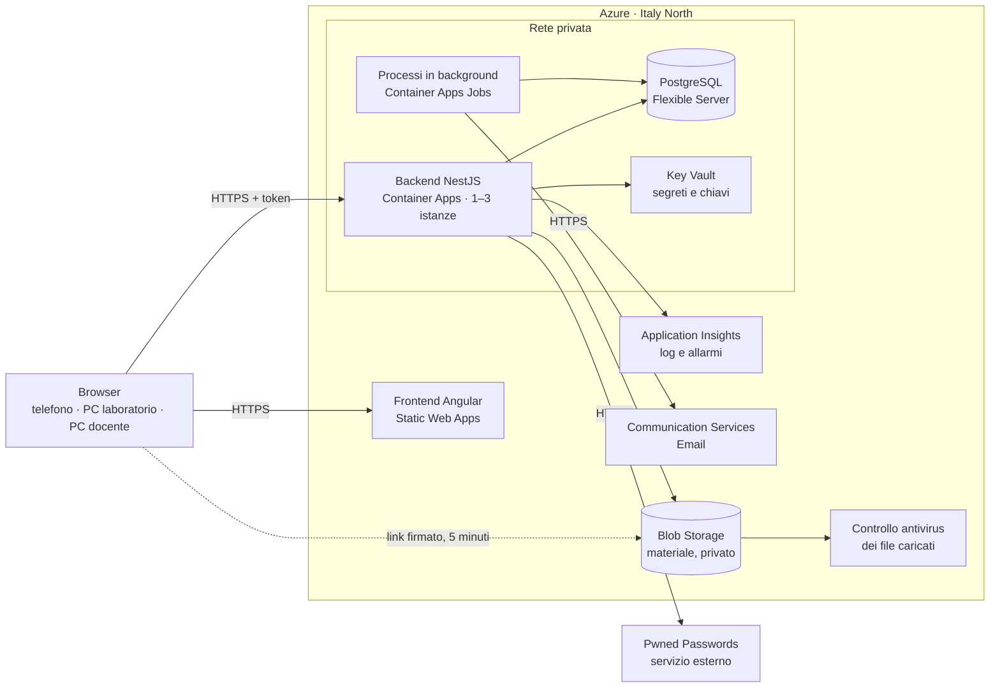
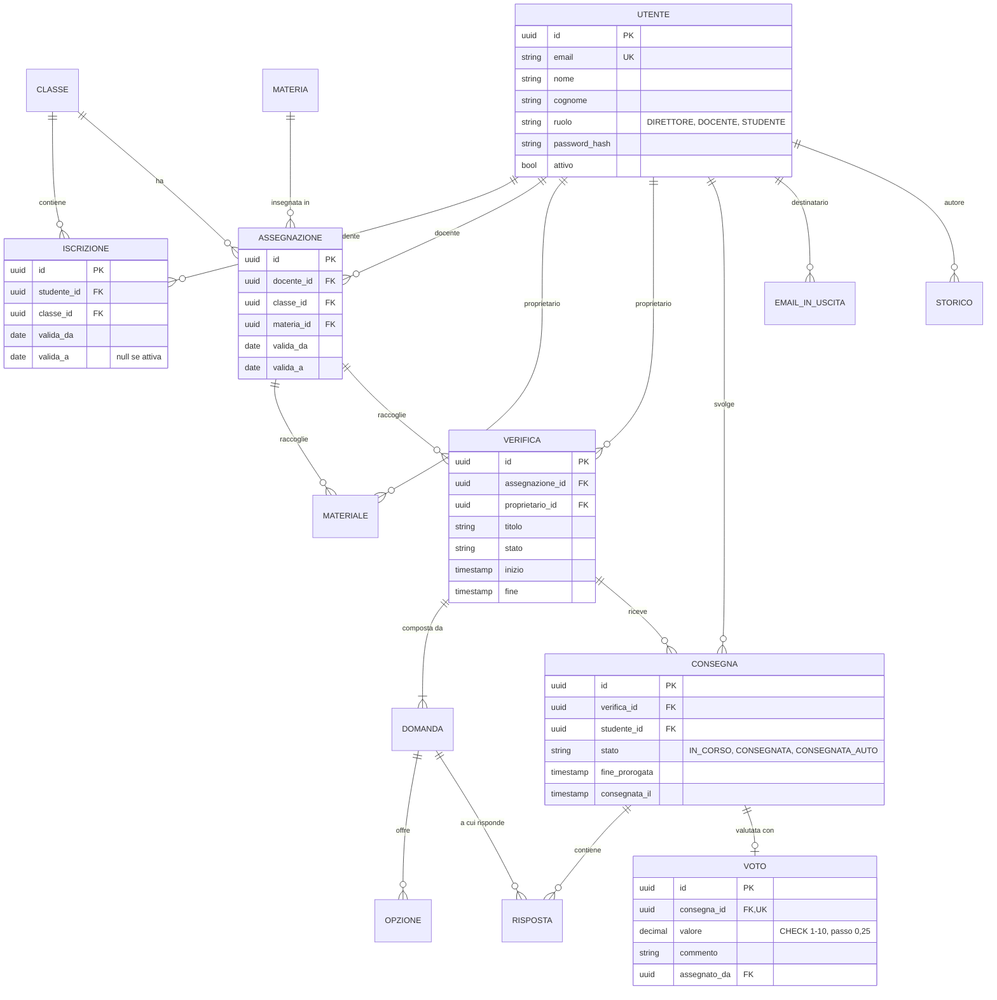

# PRD di ScuolaChill

## Informazioni sul documento

|              |                       |
| ------------ | --------------------- |
| **Prodotto** | ScuolaChill           |
| **Team**     | Progetto individuale  |
| **Autori**   | Maria Laura Iacobucci |
| **Versione** | 0.3                   |
| **Data**     | 07/10/2026            |
| **Stato**    | Bozza                 |

### Storico delle versioni

| Versione | Data       | Autore                | Cosa è cambiato e perché                                                                                                                                                         |
| -------- | ---------- | --------------------- | -------------------------------------------------------------------------------------------------------------------------------------------------------------------------------- |
| 0.1      | 23/09/2026 | Maria Laura Iacobucci | Prima stesura della prima parte, per fissare perimetro e decisioni aperte prima del resto.                                                                                       |
| 0.2      | 30/09/2026 | Maria Laura Iacobucci | Acceptance criteria aggiunti alle user story della traccia.                                                                                                                      |
| 0.3      | 07/10/2026 | Maria Laura Iacobucci | Stesura completa di seconda e terza parte. Aggiunte le funzionalità di esperienza d'uso (pagina Oggi, griglia delle cattedre, importazione degli studenti) con le loro priorità. |

---

# Prima parte · Il cosa

## 1. Scopo e perimetro

### 1.1 Perché esiste ScuolaChill

**Dal lato business.** Oggi in molte scuole il materiale dei docenti gira tra chat, email e chiavette, le verifiche sono su carta e uno studente, per sapere come sta andando, deve chiedere al professore. Il preside, per avere un quadro della scuola, mette insieme i dati a mano. ScuolaChill raccoglie classi, materiale, verifiche e voti in un unico posto, dove ognuno vede solo quello che gli spetta e trova subito quello che deve fare oggi.

**Dal lato tecnico.** ScuolaChill è un'applicazione web che si usa dal browser, sia da smartphone sia da PC. Gestisce gli account di direttore, docenti e studenti, la composizione delle classi, il materiale didattico, lo svolgimento delle verifiche online anche con connessione instabile e la registrazione dei voti. Ogni operazione passa da un controllo su chi la sta facendo e se ne ha il diritto.

### 1.2 Cosa è incluso

- Creazione, modifica e disattivazione degli account di docenti e studenti da parte del direttore, uno alla volta o importando un elenco.
- Invio delle credenziali di attivazione via email, con lettera stampabile per chi non riceve l'email.
- Creazione delle classi e delle materie, iscrizione degli studenti, assegnazione dei docenti per materia e trasferimento di uno studente da una classe all'altra.
- Caricamento, modifica ed eliminazione del materiale didattico da parte del docente, per le sue classi e materie.
- Creazione di verifiche con domande a risposta multipla e a risposta aperta, e loro svolgimento online da parte degli studenti.
- Monitoraggio in diretta della verifica da parte del docente.
- Assegnazione e correzione dei voti, con un commento facoltativo per lo studente.
- Consultazione dei voti per materia da parte dello studente.
- Una pagina "Oggi" per ogni ruolo, con le cose da fare nella giornata.
- Una panoramica per il direttore su classi, docenti, studenti, andamento dei voti e storico delle modifiche.
- Recupero della password in autonomia.
- Impostazioni di leggibilità: testo più grande, tema chiaro o scuro.

### 1.3 Cosa non è incluso

- Assenze, ritardi, giustificazioni e appello.
- Voti orali o comunque non legati a una verifica svolta su ScuolaChill.
- Pagelle, scrutini e documenti ufficiali. ScuolaChill non sostituisce il registro elettronico ufficiale della scuola.
- Comunicazioni con le famiglie e account per i genitori.
- Chat o messaggi tra utenti.
- Orario delle lezioni, calendario scolastico e prenotazione delle aule.
- Iscrizione autonoma: gli account li crea solo il direttore.
- App da scaricare dagli store. ScuolaChill si apre dal browser e, se l'utente vuole, si può aggiungere alla schermata Home del telefono.
- Notifiche push sul telefono. Gli avvisi compaiono dentro ScuolaChill.
- Correzione automatica definitiva: il sistema può suggerire un punteggio, ma il voto lo decide sempre il docente.
- Passaggio automatico all'anno scolastico successivo (promozioni, bocciature, nuove sezioni).
- Più scuole nello stesso sistema. ScuolaChill è pensato per un solo istituto.

### 1.4 Idee per una versione successiva

Non fanno parte di questo progetto, ma le tengo a mente perché alcune scelte di oggi non le devono impedire.

- Accesso con impronta digitale o riconoscimento del volto del telefono, senza password.
- Notifiche sul telefono quando esce un voto o un nuovo materiale.
- Account per i genitori, in sola lettura.
- Passaggio d'anno guidato, con le classi che salgono di un anno in blocco.

---

## 2. Stakeholder

| Stakeholder                                         | Cosa fa                                                           | Cosa gli interessa                                                                                                          | Come lo coinvolgo                                                                                                      |
| --------------------------------------------------- | ----------------------------------------------------------------- | --------------------------------------------------------------------------------------------------------------------------- | ---------------------------------------------------------------------------------------------------------------------- |
| Direttore                                           | Crea account e classi, controlla l'andamento della scuola         | Capire in pochi minuti come va la scuola, non fare da help desk per le password, non perdere dati                           | Intervista sulla sua giornata tipo, prova guidata della creazione di una classe e della panoramica durante il collaudo |
| Docenti                                             | Caricano materiale, preparano verifiche, danno i voti             | Che una verifica non si blocchi in classe, che i voti non si perdano, che nessuno tocchi le loro cose, correggere in fretta | Intervista a un docente, prova di una verifica completa con una classe                                                 |
| Studenti                                            | Studiano sul materiale, svolgono le verifiche, controllano i voti | Che le risposte non spariscano se cade il Wi-Fi, vedere subito i voti, usare il telefono                                    | Collaudo con i ragazzi del primo anno                                                                                  |
| Docente del corso                                   | Valida il PRD e valuta il progetto                                | Che ogni scelta sia motivata e che il sistema regga utenti veri                                                             | Presentazione del PRD e domande                                                                                        |
| Collaudatori del primo anno                         | Usano ScuolaChill come utenti reali                               | Un'app chiara, veloce, che funzioni al primo colpo                                                                          | Intervista sui requisiti impliciti, sessione di collaudo osservata                                                     |
| Famiglie degli studenti                             | Non usano l'app, ma i dati sono dei loro figli minorenni          | Che i dati siano protetti e non finiscano in giro                                                                           | Indirettamente, attraverso le regole sulla privacy                                                                     |
| Responsabile della protezione dei dati della scuola | Verifica che il trattamento dei dati sia lecito                   | Dati minimi, conservati in Europa, cancellati quando non servono più                                                        | Revisione della sezione sulla privacy prima di caricare dati reali                                                     |
| Chi manterrà il sistema                             | Io durante il corso, altri dopo di me                             | Codice leggibile, documentazione aggiornata, rilasci senza sorprese                                                         | README, PRD aggiornato, storico delle versioni                                                                         |

---

## 3. Destinatari e contesto d'uso

### 3.1 La scuola che ho immaginato

Ho progettato ScuolaChill per un istituto tecnico di medie dimensioni in una città del nord Italia. Le lezioni sono solo di mattina, dal lunedì al venerdì. Le verifiche si fanno di solito alla prima o alla seconda ora, quindi più classi possono iniziarne una nello stesso momento, intorno alle 9:00. I ragazzi hanno quasi tutti uno smartphone, mentre i PC sono nei laboratori e sono condivisi tra le classi.

Il personale ha un'età media alta. Molti docenti usano il registro elettronico e WhatsApp, ma non si sentono a loro agio con strumenti nuovi. Il direttore usa bene posta e fogli di calcolo e poco altro. Gli studenti, al contrario, non leggono istruzioni e abbandonano una pagina che non si carica in pochi secondi. ScuolaChill deve andare bene a entrambi.

|                                                      | Valore                                                                                       |
| ---------------------------------------------------- | -------------------------------------------------------------------------------------------- |
| Numero di studenti                                   | 590                                                                                          |
| Numero di docenti                                    | 58                                                                                           |
| Account della direzione                              | 2 (direttore e vicario)                                                                      |
| Numero di classi                                     | 26, circa 23 studenti per classe                                                             |
| Materie                                              | 14                                                                                           |
| Utenti totali                                        | 650                                                                                          |
| Orario scolastico                                    | 8:00 – 14:00, dal lunedì al venerdì                                                          |
| Classi che iniziano una verifica nello stesso minuto | al massimo 4                                                                                 |
| Connettività                                         | Wi-Fi scolastico condiviso, spesso instabile, e rete mobile degli studenti                   |
| Dispositivi                                          | Smartphone personali degli studenti, PC dei laboratori condivisi, portatili e PC dei docenti |

### 3.2 Gli archetipi

| ID      | Archetipo | Contesto d'uso                                                                                                                                                             | Competenze digitali                                                                                                          | Dispositivo principale                                                              | Frequenza d'uso                                                            |
| ------- | --------- | -------------------------------------------------------------------------------------------------------------------------------------------------------------------------- | ---------------------------------------------------------------------------------------------------------------------------- | ----------------------------------------------------------------------------------- | -------------------------------------------------------------------------- |
| ARC-001 | Direttore | Dal suo ufficio, tra una riunione e l'altra. A settembre passa ore a creare account e classi, poi entra per controllare l'andamento e preparare il collegio docenti.       | Medio-basse. Usa posta e fogli di calcolo, ha poca pazienza per le interfacce complicate e paura di "rompere qualcosa".      | PC fisso in ufficio, schermo grande                                                 | Intensa a settembre, poi due o tre volte a settimana e a fine quadrimestre |
| ARC-002 | Docente   | A casa la sera per preparare verifiche e caricare materiale, in classe per far partire una verifica e seguirla, nel pomeriggio per correggere.                             | Molto variabili. Nella stessa scuola c'è chi usa solo il registro elettronico e chi si scrive le verifiche in Markdown.      | Portatile personale, a volte il PC di classe; il telefono per controllare al volo   | Più volte a settimana, ogni giorno nei periodi di verifiche                |
| ARC-003 | Studente  | Dal telefono in corridoio o sul bus per guardare voti e materiale, in classe o in laboratorio per le verifiche. I collaudatori sono ragazzi del primo anno, circa 14 anni. | Molto pratici con il telefono, abituati ad app veloci. Non leggono le istruzioni. Alcuni hanno telefoni vecchi e pochi giga. | Smartphone, spesso Android di fascia bassa; PC del laboratorio per alcune verifiche | Quasi ogni giorno, pochi minuti alla volta; picchi quando escono i voti    |

Dentro l'archetipo del docente ci sono due profili molto diversi, e l'interfaccia li deve servire entrambi:

- **Elena Marchetto, 56 anni, Matematica.** Prepara le verifiche su carta da trent'anni. Vuole un percorso guidato, pulsanti chiari e la certezza di non perdere il lavoro.
- **Luca Ferro, 31 anni, Informatica.** Vuole fare tutto in fretta, dalla tastiera, e duplicare la stessa verifica su tre classi in un clic.

---

## 4. Panoramica e casi d'uso

### 4.1 ScuolaChill in poche righe

ScuolaChill è il posto dove la scuola tiene materiale, verifiche e voti. Lei, direttore, crea gli account di docenti e studenti e decide chi sta in quale classe e chi insegna cosa, da una griglia che le mostra subito se a una classe manca un docente. I docenti caricano il materiale e preparano le verifiche, che gli studenti svolgono dal telefono o dal PC, anche se il Wi-Fi va e viene. I voti arrivano agli studenti appena il docente li inserisce, divisi per materia. Ognuno, appena entra, trova la pagina "Oggi" con le cose da fare. Lei, da una sola pagina, vede come stanno andando le classi senza chiedere niente a nessuno. Ognuno vede solo quello che lo riguarda.

### 4.2 Come è fatta l'esperienza d'uso

Ho dato a ScuolaChill un'idea guida: **calma per chi ha paura della tecnologia, veloce per chi ha fretta.** Nella pratica diventa sei regole.

1. **Si parte sempre da "Oggi".** Dopo l'accesso nessuno trova un menu da esplorare, ma una pagina con poche schede, ognuna con un'azione sola.
   - Studente: "Verifica di Matematica alle 9:00 · Inizia", "Nuovo materiale di Storia", "Nuovo voto in Inglese".
   - Docente: "3 consegne da correggere", "Verifica 1ªB in corso · Segui".
   - Direttore: "2 email non consegnate", "Alla 2ªA manca il docente di Inglese".

   Chi non sa dove andare non deve cercare.

2. **Una sola azione principale per schermata**, scritta con il verbo che userebbe l'utente: "Consegna la verifica", "Salva il voto", "Crea la classe". Le icone sono sempre accompagnate da una parola.
3. **Le operazioni lunghe sono guidate passo per passo.** Creare una classe o una verifica è una procedura in pochi passi, con l'indicazione "Passo 2 di 4" e la possibilità di tornare indietro senza perdere niente. Le bozze si salvano da sole.
4. **Scorciatoie per chi va veloce.** Una barra "Cerca o fai qualcosa" (Ctrl+K sul PC) permette di scrivere "1ªB", "Giulia Rossato" o "nuova verifica" e arrivarci subito. Le verifiche si duplicano su un'altra classe. Il docente può correggere domanda per domanda invece che studente per studente.
5. **Leggibilità regolabile.** Il pulsante "Aa" ingrandisce tutto il testo, e la scelta resta salvata. Si può passare dal tema chiaro a quello scuro. I pulsanti sono grandi anche sul telefono.
6. **Niente si perde in silenzio.** Ogni cosa scritta si salva da sola e lo si vede ("Salvato alle 9:14"). Prima di ogni azione che non si può annullare c'è una conferma che dice la conseguenza in parole semplici: "Trasferisci Marco in 1ªB? Non vedrà più il materiale della 1ªA. I suoi voti restano."

**Lo stile visivo.** I colori sono pastello, morbidi, con testo sempre scuro e ben contrastato. C'è una piccola mascotte, Chilly, uno scudo sorridente che ricorda che i dati sono al sicuro. Compare solo nei momenti tranquilli: il benvenuto, una pagina ancora vuota, una consegna andata a buon fine. Non compare mai accanto a un voto o a un errore, perché un sorriso vicino a un 4 in matematica sarebbe fuori luogo. I voti si leggono come a scuola (6+, 6½, 7−). Quelli insufficienti sono segnalati con la parola "insufficiente" e non solo con il colore, così li riconosce anche chi non distingue il rosso.

**Il primo accesso.** Al primo ingresso una breve presentazione di tre schermate, che si può saltare, mostra le tre cose principali che quel ruolo può fare. Ogni pagina ha un "?" con una spiegazione di due righe.

### 4.3 User flow e scenari

#### Direttore

##### DIR-02 · Creare account studente

**User flow**

1. Il direttore accede e apre Persone → Studenti.
2. Sceglie "Aggiungi uno studente" oppure "Importa un elenco".
3. Per un solo studente inserisce nome, cognome ed email. Per un elenco carica il foglio di calcolo che la segreteria gli ha già dato.
4. Se importa un elenco, ScuolaChill gli mostra un'anteprima: le righe valide in verde, quelle con errori in evidenza, con il motivo.
5. Conferma. Gli studenti compaiono nell'elenco con lo stato dell'email di attivazione.
6. Ogni studente riceve un link di attivazione, sceglie la sua password e accede.

**Scenario principale.** È il 5 settembre e il direttore Giorgio Bortolin deve inserire i 120 nuovi iscritti delle prime. Apre "Importa un elenco" e carica il file della segreteria. L'anteprima gli segnala due righe senza email e un indirizzo già usato. Corregge le due righe direttamente nell'anteprima, toglie il doppione e conferma. In meno di dieci minuti tutti gli studenti hanno un account. La sera Giulia Rossato apre il link dal telefono, sceglie una password e vede la sua pagina "Oggi".

**Scenari alternativi.**

- Il direttore crea uno studente a mano, dimentica il cognome e scrive l'email senza la chiocciola. ScuolaChill evidenzia i due campi con un messaggio che dice cosa correggere, e non crea niente.
- L'email è già usata da un altro utente. Il direttore riceve un messaggio chiaro e l'account non viene creato.
- Il servizio che invia le email non risponde. Gli account vengono creati lo stesso e il sistema riprova da solo più tardi. Se dopo alcune ore un'email non è ancora partita, nella pagina "Oggi" del direttore compare "3 email non consegnate". Accanto a ogni studente ci sono "Reinvia" e "Stampa lettera di attivazione".
- Giulia non apre il link entro 72 ore. Il link scade e il direttore può generarne uno nuovo.

##### DIR-03 · Creare classi e comporle

**User flow**

1. Il direttore apre Classi e preme "Crea una classe".
2. Passo 1: nome della classe (es. 1ªB) e indirizzo di studio.
3. Passo 2: sceglie gli studenti da un elenco di quelli senza classe, cercando per nome o spuntandoli.
4. Passo 3: per ogni materia della classe sceglie il docente.
5. Passo 4: riepilogo e conferma.
6. Dopo la creazione, la **griglia delle cattedre** (classi in riga, materie in colonna, docente in ogni casella) mostra la nuova classe. Le caselle vuote sono evidenziate.

**Scenario principale.** Il direttore crea la 1ªB, sceglie 23 studenti e assegna Elena Marchetto per Matematica e Luca Ferro per Informatica. Lascia vuota Inglese perché il docente arriva la settimana dopo. Nella griglia la casella 1ªB · Inglese resta evidenziata, e nella sua pagina "Oggi" compare "Alla 1ªB manca il docente di Inglese". Da quel momento Elena vede la 1ªB tra le sue classi, ma solo per Matematica.

**Scenari alternativi.**

- Il direttore prova ad aggiungere alla 1ªB uno studente che è già in 1ªA. ScuolaChill non lo aggiunge e propone l'azione esplicita "Trasferisci".
- A ottobre Marco Zanin passa dalla 1ªA alla 1ªB. Il direttore usa "Trasferisci": Marco perde l'accesso al materiale della 1ªA e vede quello della 1ªB. I voti già presi in 1ªA restano suoi, legati alla verifica, alla classe e al docente di allora.
- Marco ha una verifica in corso al momento del trasferimento. ScuolaChill blocca l'operazione e spiega che bisogna aspettare la consegna.
- Il direttore assegna due volte lo stesso docente alla stessa classe per la stessa materia. L'operazione viene rifiutata perché l'assegnazione esiste già.
- Il direttore prova a eliminare una classe che ha studenti iscritti. ScuolaChill non lo permette e spiega che prima vanno trasferiti.

##### DIR-04 · Vedere tutto

**User flow**

1. Il direttore accede e apre Panoramica.
2. In alto vede quattro numeri: studenti, docenti, classi, media generale dei voti del mese.
3. Sotto vede le classi con il numero di studenti e la media per materia, i docenti con le loro materie e l'andamento dei voti mese per mese.
4. Apre il dettaglio di una classe o di un docente. Gli elenchi lunghi sono divisi in pagine.
5. Dalla scheda "Storico" vede chi ha modificato voti e account, quando e perché.

**Scenario principale.** A fine novembre il direttore apre la Panoramica prima del collegio docenti. Nota che la media di Matematica in 1ªC è molto più bassa di quella delle altre prime. Apre il dettaglio e vede che le ultime due verifiche sono andate male. Ne parla con la docente in riunione, senza aver chiesto un solo dato a nessuno.

**Scenari alternativi.**

- Un docente scopre l'indirizzo della Panoramica e prova ad aprirlo. Riceve un messaggio di accesso negato e non vede nessun dato.
- I dati della Panoramica hanno qualche minuto di ritardo rispetto ai voti appena inseriti. La pagina indica l'ora dell'ultimo aggiornamento.
- Una classe non ha ancora voti. Al posto della media compare "Ancora nessun voto", non uno zero.

#### Docente

##### DOC-01 · Caricare materiale didattico

**User flow**

1. Il docente apre una sua classe e la materia, oppure usa "Carica materiale" dalla pagina "Oggi".
2. Trascina il file nella pagina o lo sceglie dal computer, oppure incolla il link di un video. Scrive un titolo.
3. Può scegliere di pubblicarlo anche in altre sue classi della stessa materia.
4. Conferma. Il materiale compare con lo stato "In controllo" e, dopo pochi secondi, "Pubblicato".

**Scenario principale.** Domenica sera Elena Marchetto carica un PDF con gli esercizi sulle equazioni e lo pubblica in 1ªB e in 1ªC. Lunedì mattina Giulia lo trova nella sua pagina "Oggi" ("Nuovo materiale di Matematica") e lo apre dal telefono sul bus.

**Scenari alternativi.**

- Elena prova a caricare un file di 40 MB o un documento con macro. ScuolaChill lo rifiuta spiegando formati e dimensione ammessi.
- Elena prova a caricare materiale in una classe dove non insegna. L'operazione viene negata.
- Luca Ferro prova a eliminare il PDF di Elena. L'operazione viene negata: solo chi ha caricato il materiale può modificarlo o eliminarlo.
- Il controllo di sicurezza trova un problema nel file. Il file non viene mai mostrato agli studenti ed Elena vede lo stato "Rifiutato" con la spiegazione.

##### DOC-02 · Creare le proprie verifiche

**User flow**

1. Il docente apre una sua classe e materia e preme "Nuova verifica".
2. Passo 1: titolo, data, orario di inizio e di fine.
3. Passo 2: le domande, a risposta multipla o aperta. Ogni domanda ha un punteggio.
4. Passo 3: anteprima di come la vedranno gli studenti, anche nella versione per telefono.
5. Salva come bozza oppure la programma. Gli studenti della classe la vedono in elenco con la data, ma senza le domande.
6. All'orario di inizio la verifica si apre da sola, all'orario di fine si chiude da sola.

**Scenario principale.** Elena prepara la verifica "Equazioni di primo grado" per la 1ªB, giovedì dalle 9:00 alle 9:50, con otto domande a risposta multipla e due aperte. La salva in bozza, il giorno dopo la rilegge in anteprima, corregge un testo e la programma. Luca, che insegna in tre seconde, prepara una verifica sola e la duplica sulle altre due classi cambiando solo l'orario.

**Scenari alternativi.**

- Alle 9:05 Elena si accorge di un errore nel testo di una domanda. La verifica è già aperta e il contenuto non si può più modificare: può solo prolungare l'orario di fine o annullarla scrivendo il motivo.
- Una verifica senza nessuna consegna si può eliminare. Se almeno uno studente ha consegnato, si può solo annullare.
- Luca prova a modificare la verifica di Elena. L'operazione viene negata.

##### DOC-03 · Assegnare i voti

**User flow**

1. Durante la verifica il docente può aprire "Segui la verifica" e vedere chi l'ha iniziata, chi è offline e chi ha consegnato.
2. Dopo la chiusura apre la verifica e vede l'elenco delle consegne.
3. Per le domande a risposta multipla trova un punteggio suggerito. Le risposte aperte le legge studente per studente, oppure domanda per domanda per tutta la classe.
4. Inserisce il voto di ogni studente, con un commento facoltativo, e conferma. Lo studente lo vede tra i suoi voti.

**Scenario principale.** Giovedì alle 9:20 Elena, da "Segui la verifica", vede che Marco risulta offline da tre minuti: gli dice che le risposte sono al sicuro e di continuare. Venerdì pomeriggio corregge. ScuolaChill le suggerisce il punteggio della parte a crocette. Lei legge la domanda aperta numero 9 di tutti e 23 gli studenti uno dopo l'altro, poi la numero 10. Dà a Giulia 7½ con il commento "Ottimo il procedimento, attenta ai segni". Giulia riceve il voto la sera stessa.

**Scenari alternativi.**

- Elena scrive 6,3 oppure 11. ScuolaChill non salva e le ricorda quali voti sono ammessi (da 1 a 10, a passi di un quarto).
- Elena si accorge di aver sbagliato un voto già registrato. Può correggerlo, ma deve scrivere il motivo, e la modifica resta nello storico.
- Uno studente non ha consegnato. Per lui non si può inserire un voto su quella verifica.
- Una chiamata diretta per dare un voto alla verifica di un collega viene negata, anche se la verifica non compare nell'interfaccia.

#### Studente

##### STU-01 · Consultare il materiale didattico

**User flow**

1. Lo studente accede e vede le materie della sua classe, ognuna con il nome del docente.
2. Apre una materia e trova il materiale dal più recente, con i nuovi segnalati.
3. Apre o scarica il file.

**Scenario principale.** La sera prima della verifica Marco apre Matematica dal telefono, trova il PDF degli esercizi segnato come "nuovo" e lo scarica.

**Scenari alternativi.**

- Un amico della 1ªA gli manda il link di un materiale della sua classe. Marco lo apre ma riceve accesso negato.
- La materia non ha ancora materiale. La pagina lo dice chiaramente, con Chilly, invece di restare vuota.

##### STU-02 · Svolgere una verifica

**User flow**

1. Lo studente accede. Nella pagina "Oggi" trova "Verifica di Matematica · 9:00".
2. All'orario di inizio preme "Inizia".
3. Risponde alle domande, una per schermata sul telefono o tutte insieme sul PC. Ogni risposta si salva mentre scrive e la pagina mostra "Salvato alle 9:14". Un contatore indica il tempo rimasto.
4. Preme "Consegna". Un riepilogo mostra quante domande ha lasciato senza risposta. Conferma.
5. Vede la conferma con l'orario di consegna.

**Scenario principale.** Giovedì alle 9:00 Giulia apre la verifica di Matematica dal telefono, insieme ad altre tre classi che iniziano nello stesso momento. La pagina si apre subito, lei risponde alle dieci domande e consegna alle 9:42.

**Scenari alternativi.**

- A metà verifica il Wi-Fi della scuola cade. Compare un avviso tranquillo: "Sei offline. Le tue risposte sono al sicuro su questo dispositivo." Giulia continua a scrivere e, quando la connessione torna, tutto si sincronizza da solo.
- Il telefono di Marco si spegne. Marco si fa prestare un PC del laboratorio, accede e riprende la stessa verifica dal punto in cui era.
- Il tempo scade mentre Marco sta ancora scrivendo. Conta l'orologio del server, non quello del telefono. Le risposte ancora in viaggio vengono accettate per 60 secondi dopo la scadenza, poi la verifica viene consegnata automaticamente con quello che c'è. Il docente la vede come "consegnata automaticamente" e può concedere una proroga.
- Giulia prova a riaprire una verifica già consegnata. L'operazione viene negata.
- Giulia apre la verifica in due schede. È sempre lo stesso tentativo e la consegna vale una sola volta.
- Uno studente prova ad aprire la verifica di un'altra classe. L'operazione viene negata.

##### STU-03 · Consultare i propri voti

**User flow**

1. Lo studente accede e apre Voti.
2. Vede una scheda per ogni materia con la media e l'elenco dei voti, ciascuno con il titolo della verifica, la data e l'eventuale commento.
3. Apre una materia e vede l'andamento dei suoi voti nel tempo.
4. Se vuole, usa "Quanto mi serve?": scrive la media che vuole raggiungere e ScuolaChill gli dice che voto gli servirebbe nella prossima verifica.

**Scenario principale.** Il venerdì sera Giulia apre Voti e trova il 7½ di Matematica sotto "Equazioni di primo grado", con il commento della docente. La sua media di Matematica sale a 6¾. Con "Quanto mi serve?" scopre che con un 8 alla prossima verifica arriverebbe al 7.

**Scenari alternativi.**

- Marco modifica l'indirizzo della pagina per vedere i voti di Giulia. Riceve accesso negato, perché ogni studente può leggere solo i propri.
- Marco è stato trasferito dalla 1ªA alla 1ªB. Vede anche i voti presi in 1ªA, con la classe e il docente di allora.
- Il docente corregge un voto. Lo studente vede il voto aggiornato.

---

## 5. Requisiti funzionali

### 5.1 Le user story della traccia

Gli acceptance criteria della traccia restano tutti validi. Qui riporto quelli che ho aggiunto.

| ID     | Storia                            | AC aggiunti dal team                                                                                                                                                                                                                                                                                                                                                                                                                                                                                                                                               | Note                                                                 |
| ------ | --------------------------------- | ------------------------------------------------------------------------------------------------------------------------------------------------------------------------------------------------------------------------------------------------------------------------------------------------------------------------------------------------------------------------------------------------------------------------------------------------------------------------------------------------------------------------------------------------------------------ | -------------------------------------------------------------------- |
| DIR-01 | Creare account docente            | AC-04 · Dato che creo un docente, Quando la creazione va a buon fine, Allora il docente riceve un'email con un link di attivazione valido 72 ore e nessuna password viene inviata per email.<br>AC-05 · Dato che l'email non è stata consegnata, Quando apro l'elenco dei docenti, Allora vedo lo stato "non consegnata" e posso reinviarla o stampare un codice di attivazione.                                                                                                                                                                                   | FR-INT-01, FR-ACC-01                                                 |
| DIR-02 | Creare account studente           | AC-04 · Dato che creo uno studente, Quando la creazione va a buon fine, Allora lo studente riceve un link di attivazione valido 72 ore.<br>AC-05 · Dato che disattivo uno studente, Quando prova ad accedere, Allora l'accesso viene negato ma i suoi voti restano nel sistema.                                                                                                                                                                                                                                                                                    | FR-INT-01, FR-ACC-01, FR-ACC-02                                      |
| DIR-03 | Creare classi e comporle          | AC-04 · Dato che trasferisco uno studente, Quando confermo, Allora la vecchia iscrizione si chiude con la data del trasferimento, i voti restano legati alle verifiche di origine e lo studente vede solo il materiale della nuova classe.<br>AC-05 · Dato che lo studente ha una verifica in corso, Quando provo a trasferirlo, Allora l'operazione viene impedita finché non consegna.<br>AC-06 · Dato che un docente è già assegnato a una classe per una materia, Quando provo ad assegnarlo di nuovo, Allora ricevo un errore e non viene creato un doppione. | Per AC-03 ho scelto il trasferimento esplicito: FR-CLA-01. FR-ASS-01 |
| DIR-04 | Vedere tutto                      | AC-04 · Dato che apro la vista complessiva, Quando i dati vengono mostrati, Allora vedo anche l'ora del loro ultimo aggiornamento.<br>AC-05 · Dato che apro il dettaglio di una classe, Quando la classe ha voti, Allora vedo la media per materia.                                                                                                                                                                                                                                                                                                                | Include lo storico delle modifiche su voti e account                 |
| DOC-01 | Caricare materiale didattico      | AC-04 · Dato che carico un file di formato non ammesso o più grande di 25 MB, Quando confermo, Allora ricevo un errore che indica formati e dimensione ammessi.<br>AC-05 · Dato che ho caricato un file, Quando il controllo di sicurezza non è ancora concluso o lo ha rifiutato, Allora gli studenti non lo vedono e io vedo lo stato del file.                                                                                                                                                                                                                  | FR-MAT-01                                                            |
| DOC-02 | Creare le proprie verifiche       | AC-04 · Dato che una mia verifica è aperta, Quando provo a modificarne le domande, Allora l'operazione viene negata; posso solo prolungare l'ora di fine o annullarla indicando il motivo.<br>AC-05 · Dato che una mia verifica ha almeno una consegna, Quando provo a eliminarla, Allora posso solo annullarla.                                                                                                                                                                                                                                                   | Regole dopo lo svolgimento: FR-VER-01. FR-VER-03                     |
| DOC-03 | Assegnare i voti                  | AC-04 · Dato che correggo un voto già salvato, Quando confermo, Allora devo indicare un motivo e la correzione resta nello storico.<br>AC-05 · Dato che uno studente non ha consegnato la verifica, Quando provo a dargli un voto per quella verifica, Allora l'operazione viene negata.                                                                                                                                                                                                                                                                           | Scala dei voti: FR-VOT-01. FR-VOT-02                                 |
| STU-01 | Consultare il materiale didattico | AC-03 · Dato che sono stato trasferito in un'altra classe, Quando cerco il materiale della classe precedente, Allora non lo vedo più.<br>AC-04 · Dato che una materia ha più materiali di quanti ne stanno in una pagina, Quando la apro, Allora li vedo paginati, dal più recente.                                                                                                                                                                                                                                                                                | FR-CLA-01, FR-MAT-01                                                 |
| STU-02 | Svolgere una verifica             | AC-04 · Dato che perdo la connessione durante la verifica, Quando torno online prima dell'ora di fine, Allora ritrovo tutte le risposte date e posso continuare.<br>AC-05 · Dato che arriva l'ora di fine e non ho consegnato, Quando il tempo scade, Allora la verifica viene consegnata in automatico con le risposte salvate.<br>AC-06 · Dato che apro la stessa verifica da un altro dispositivo, Quando riprendo, Allora continuo lo stesso tentativo con le risposte già date.                                                                               | FR-VER-02                                                            |
| STU-03 | Consultare i propri voti          | AC-03 · Dato che un mio voto viene corretto, Quando apro la pagina dei voti, Allora vedo il voto aggiornato.<br>AC-04 · Dato che ho voti con +, ½ o −, Quando li consulto, Allora li vedo scritti come li scriverebbe il docente (per esempio 6+, 6½, 7−).                                                                                                                                                                                                                                                                                                         | FR-VOT-01                                                            |

### 5.2 Le decisioni lasciate aperte dalla traccia

> **FR-VOT-01 · Scala dei voti** (collegato a DOC-03, STU-03)
> I voti vanno da 1 a 10 a passi di un quarto. A schermo si leggono come a scuola: 6,25 diventa "6+", 6,5 diventa "6½", 6,75 diventa "7−". Qualsiasi valore fuori scala o non multiplo di un quarto viene rifiutato.
> _Motivazione:_ è il modo in cui i docenti italiani danno i voti. Conservare il voto come numero permette di calcolare le medie in modo esatto.
> _Scartato:_ salvare "6+" come testo, perché poi le medie non si calcolano; una scala da 0 a 100, perché nessuno a scuola ragiona così.

> **FR-CLA-01 · Trasferimento di uno studente fra classi** (collegato a DIR-03, STU-01, STU-03)
> Solo il direttore può trasferire uno studente, con l'azione esplicita "Trasferisci". L'iscrizione alla vecchia classe viene chiusa con una data di fine e ne viene aperta una nuova. I voti restano legati alle verifiche da cui vengono, con la classe, la materia e il docente originali. Lo studente perde l'accesso al materiale della vecchia classe e ottiene quello della nuova. Se ha una verifica in corso, il trasferimento è bloccato finché non consegna.
> _Motivazione:_ lo storico non va mai riscritto, e una verifica a metà non deve finire nella classe sbagliata.
> _Scartato:_ vietare i trasferimenti, perché nella realtà succedono; spostare i vecchi voti nella nuova classe, perché falserebbe i dati.

> **FR-VER-01 · Ciclo di vita e modifica di una verifica** (collegato a DOC-02)
> Una verifica passa per questi stati: Bozza → Programmata → Aperta → Chiusa → Valutata. Può anche essere Annullata.
>
> - In Bozza e Programmata il docente può modificare tutto.
> - Da quando si apre, il contenuto è bloccato. Il docente può solo prolungare l'orario di fine o annullarla scrivendo il motivo.
> - Una verifica con almeno una consegna non si può eliminare, solo annullare.
> - Diventa Valutata quando tutte le consegne hanno un voto.
> - I voti si possono correggere anche dopo, ma serve un motivo e la modifica resta nello storico.
>
> _Motivazione:_ cambiare le domande a verifica iniziata è ingiusto verso chi ha già risposto.
> _Scartato:_ modifica libera anche dopo l'apertura; blocco totale senza possibilità di correggere un voto sbagliato.

> **FR-VER-02 · Connessione che cade durante una verifica** (collegato a STU-02)
>
> - Ogni risposta viene salvata sul server mentre lo studente scrive. Il dispositivo tiene anche una copia locale di quello che non è ancora stato inviato.
> - Quando la connessione cade compare l'avviso "Sei offline. Le tue risposte sono al sicuro su questo dispositivo." Al ritorno della connessione tutto si sincronizza da solo, nell'ordine giusto.
> - Lo studente può riprendere da un altro dispositivo, perché il tentativo è sempre lo stesso.
> - Il tempo segue l'orologio del server. Il server accetta le risposte ancora in viaggio per 60 secondi dopo la scadenza, poi consegna in automatico quello che ha. Il docente vede queste verifiche come "consegnate automaticamente" e può concedere una proroga al singolo studente.
>
> _Motivazione:_ il Wi-Fi della scuola che cade è la normalità, non un'eccezione.
> _Scartato:_ salvare solo alla consegna, perché basterebbe un calo del Wi-Fi per perdere tutta la verifica.

> **FR-INT-01 · Il servizio email esterno non funziona** (collegato a DIR-01, DIR-02)
> La creazione di un account non dipende mai dal servizio email. L'account viene salvato insieme a un promemoria "email da inviare". Un processo in background riprova l'invio a intervalli crescenti, 5 tentativi in circa 8 ore, poi segna l'email come non consegnata. Il direttore vede lo stato di consegna di ogni account, con "Reinvia" e "Stampa lettera di attivazione". La lettera contiene un codice monouso per chi non riceve l'email.
> _Motivazione:_ un servizio esterno fermo non deve mai bloccare la scuola.
> _Scartato:_ annullare tutta la creazione se l'email fallisce, perché il direttore dovrebbe reinserire tutto da capo.

### 5.3 Altre decisioni che ho preso

Queste coprono casi che le user story non dicono, ma che succederanno sicuramente.

> **FR-ACC-01 · Disattivazione degli account** (collegato a DIR-01, DIR-02)
> Durante l'anno scolastico gli account non vengono mai cancellati, solo disattivati: l'accesso si blocca, ma voti, materiale e verifiche restano. A fine anno gli account degli studenti che lasciano la scuola vengono disattivati e i loro dati cancellati dopo 12 mesi, salvo diversa indicazione della scuola.
> _Motivazione:_ un clic sbagliato del direttore non deve cancellare un anno di voti.
> _Scartato:_ cancellazione immediata e definitiva.

> **FR-ACC-02 · Password dimenticata** (collegato a DIR-01, DIR-02)
> Ogni utente può reimpostare la password da solo tramite un link via email. Il direttore può anche generare una nuova lettera di attivazione per chi non ha un'email affidabile. Nessuna password viene mai inviata o mostrata in chiaro.
> _Motivazione:_ altrimenti il direttore diventa l'help desk delle password.
> _Scartato:_ reset solo tramite il direttore.

> **FR-ACC-03 · Accesso più protetto per il personale** (collegato a DIR-01, DOC-03)
> Direttore e docenti, oltre alla password, confermano l'accesso con un codice di sei cifre generato da un'app sul telefono. Chi non riesce a usare l'app può ricevere il codice via email. Sul proprio dispositivo personale si può scegliere "Ricorda questo dispositivo per 30 giorni". Al primo accesso ognuno riceve dei codici di emergenza da stampare.
> _Motivazione:_ chi può cambiare i voti non deve essere a rischio per una sola password rubata. Il codice via email e il dispositivo ricordato tengono la protezione sopportabile anche per chi ha poca dimestichezza.
> _Scartato:_ solo password, troppo debole; codice obbligatorio a ogni accesso, troppo faticoso e quindi aggirato.

> **FR-ASS-01 · Docente che lascia o viene sostituito** (collegato a DIR-03, DOC-01, DOC-02)
> La sua assegnazione viene chiusa, mentre il materiale e le verifiche restano visibili agli studenti. Il direttore può trasferire esplicitamente la proprietà dei contenuti al nuovo docente.
> _Motivazione:_ mantiene la regola "solo se è mio" di DOC-01 e DOC-02 senza lasciare contenuti orfani.
> _Scartato:_ eliminare i contenuti del docente uscito; far modificare a chiunque i contenuti senza proprietario.

> **FR-ASS-02 · Un docente per materia in ogni classe** (collegato a DIR-03, STU-01)
> In ogni classe, per ogni materia, c'è al massimo un docente attivo. Se il direttore assegna un secondo docente alla stessa casella, ScuolaChill gli chiede se vuole sostituire il primo.
> _Motivazione:_ lo studente deve sapere chi è "il docente di quella materia", come dice STU-01. Le compresenze sono rare e restano fuori da questa versione.
> _Scartato:_ più docenti sulla stessa materia, che complicherebbe permessi e voti.

> **FR-VOT-02 · Assenti e voti orali** (collegato a DOC-03)
> Un voto esiste solo per una verifica consegnata. Assenze e voti orali sono fuori perimetro (vedi 1.3).
> _Motivazione:_ DOC-03 lega il voto a una verifica svolta. Seguire la traccia tiene il modello semplice.
> _Scartato:_ voti liberi senza verifica, che aprirebbero un secondo registro fuori dalla traccia.

> **FR-VER-03 · Tipi di domanda** (collegato a DOC-02, DOC-03, STU-02)
> Le verifiche hanno domande a risposta multipla (una sola risposta giusta) e a risposta aperta. Per la risposta multipla il sistema suggerisce un punteggio, ma il voto finale lo decide sempre il docente.
> _Motivazione:_ lavoro da sola e devo tenere il perimetro sotto controllo. La valutazione resta una decisione del docente.
> _Scartato:_ altri tipi di domanda (abbinamenti, completamento, caricamento di file), rimandati.

> **FR-VER-04 · Le domande restano segrete fino all'apertura** (collegato a DOC-02, STU-02)
> Prima dell'orario di inizio lo studente vede titolo, materia, data e durata, ma non le domande. Le risposte corrette non arrivano mai sul dispositivo dello studente, nemmeno durante la verifica.
> _Motivazione:_ altrimenti basterebbe guardare dentro la pagina per copiare.
> _Scartato:_ inviare tutta la verifica in anticipo per risparmiare tempo all'apertura.

> **FR-MAT-01 · File del materiale** (collegato a DOC-01, STU-01)
> Sono ammessi PDF, documenti Office senza macro, immagini e link a video, fino a 25 MB per file. Il formato si controlla sul contenuto reale del file, non solo sull'estensione. Un file è visibile agli studenti solo dopo il controllo di sicurezza.
> _Motivazione:_ un file caricato da un account rubato non deve poter infettare i dispositivi degli studenti.
> _Scartato:_ qualsiasi formato senza limiti.

> **FR-SES-01 · PC condivisi dei laboratori** (collegato a STU-01, STU-02, STU-03)
> Gli studenti vengono disconnessi dopo 20 minuti di inattività, con un avviso 2 minuti prima. Durante una verifica aperta la disconnessione non scatta. Il pulsante "Esci" è sempre visibile.
> _Motivazione:_ nei laboratori il PC dopo di te lo usa un compagno.
> _Scartato:_ sessioni lunghe con "ricordami", comode ma rischiose su un PC condiviso.

### 5.4 Funzionalità per l'esperienza d'uso

Queste funzionalità non sono chieste dalla traccia. Le ho aggiunte perché rendono ScuolaChill usabile sia da chi ha poca dimestichezza sia da chi va di fretta. Le ho divise per priorità, così se il tempo non basta so cosa tagliare. **Must**: senza, il progetto non è consegnabile. **Should**: le faccio se resto nei tempi. **Could**: solo se avanza tempo.

| ID       | Funzionalità                                                                                                  | Per chi            | Priorità | Storie collegate               |
| -------- | ------------------------------------------------------------------------------------------------------------- | ------------------ | -------- | ------------------------------ |
| FR-UX-01 | Pagina "Oggi" con le cose da fare per ogni ruolo                                                              | Tutti              | Should   | DIR-04, DOC-03, STU-02         |
| FR-UX-02 | Griglia delle cattedre: classi per materie, con le caselle senza docente evidenziate                          | Direttore          | Should   | DIR-03                         |
| FR-UX-03 | Creazione guidata a passi di classi e verifiche, con bozza salvata in automatico                              | Direttore, Docente | Must     | DIR-03, DOC-02                 |
| FR-UX-04 | Importazione degli studenti da foglio di calcolo, con anteprima e correzione degli errori prima di confermare | Direttore          | Should   | DIR-02                         |
| FR-UX-05 | Pulsante "Aa" per ingrandire il testo e scelta del tema chiaro o scuro, ricordati per ogni utente             | Tutti              | Must     | tutte                          |
| FR-UX-06 | "Segui la verifica": stato in diretta di ogni studente (non iniziata, in corso, offline, consegnata)          | Docente            | Should   | STU-02, DOC-03                 |
| FR-UX-07 | Correzione domanda per domanda e commento facoltativo al voto                                                 | Docente            | Should   | DOC-03, STU-03                 |
| FR-UX-08 | Duplicare una verifica su un'altra propria classe della stessa materia                                        | Docente            | Could    | DOC-02                         |
| FR-UX-09 | Pubblicare lo stesso materiale in più proprie classi in una volta                                             | Docente            | Could    | DOC-01                         |
| FR-UX-10 | Media per materia, andamento nel tempo e "Quanto mi serve?"                                                   | Studente           | Could    | STU-03                         |
| FR-UX-11 | Barra "Cerca o fai qualcosa" (Ctrl+K)                                                                         | Tutti              | Could    | tutte                          |
| FR-UX-12 | Avvisi dentro l'app: nuovo voto, nuovo materiale, verifica programmata, email non consegnata                  | Tutti              | Should   | DIR-01, DOC-01, STU-01, STU-03 |
| FR-UX-13 | Aggiunta alla schermata Home del telefono, con apertura a schermo intero                                      | Studente           | Should   | STU-02                         |

---

## 6. Requisiti non funzionali

Gli utenti concorrenti usati qui vengono dalla stima del carico (sezione 8): circa 65 in una giornata normale, circa 150 al picco delle 9:00, 300 come obiettivo di progetto, cioè il doppio del picco.

| ID     | Famiglia      | Requisito                                      | Soglia e condizione                                                                                                                                                                                                                                | Come si verifica                                                                  | Storie collegate       |
| ------ | ------------- | ---------------------------------------------- | -------------------------------------------------------------------------------------------------------------------------------------------------------------------------------------------------------------------------------------------------- | --------------------------------------------------------------------------------- | ---------------------- |
| NFR-01 | Prestazioni   | Apertura della verifica al picco               | Meno di 2 s per il 95% delle richieste, con 150 utenti che aprono una verifica nello stesso minuto                                                                                                                                                 | Test di carico che simula 4 classi alle 9:00                                      | STU-02                 |
| NFR-02 | Prestazioni   | Salvataggio di una risposta                    | Meno di 1 s per il 95% dei salvataggi durante il picco                                                                                                                                                                                             | Test di carico                                                                    | STU-02                 |
| NFR-03 | Prestazioni   | Pagine di consultazione                        | Meno di 1,5 s per il 95% delle richieste con 65 utenti. Panoramica del direttore in meno di 3 s, con dati aggiornati al massimo 5 minuti prima                                                                                                     | Test di carico, misure durante il collaudo                                        | STU-01, STU-03, DIR-04 |
| NFR-04 | Prestazioni   | Prima apertura su un telefono lento            | Pagina "Oggi" utilizzabile in meno di 4 s su un telefono Android di fascia bassa con rete 3G                                                                                                                                                       | Misura con rete e processore rallentati nel browser                               | STU-01, STU-02         |
| NFR-05 | Scalabilità   | Tenuta oltre il picco previsto                 | Con 300 utenti concorrenti restano valide le soglie di NFR-01 e NFR-02, con meno dell'1% di richieste in errore                                                                                                                                    | Test di carico a 300 utenti                                                       | STU-02, DOC-03         |
| NFR-06 | Disponibilità | ScuolaChill raggiungibile in orario scolastico | 99,5% del tempo dalle 7:30 alle 14:30, dal lunedì al venerdì. Nessun aggiornamento in quella fascia                                                                                                                                                | Controllo automatico della raggiungibilità ogni minuto                            | tutte                  |
| NFR-07 | Disponibilità | Nessun dato perso                              | Zero voti e zero consegne persi. In caso di guasto si ripristinano i dati di un qualsiasi momento degli ultimi 35 giorni, perdendo al massimo 5 minuti di lavoro                                                                                   | Prova di ripristino una volta al mese; confronto tra voti inseriti e voti salvati | DOC-03, STU-02, STU-03 |
| NFR-08 | Sicurezza     | Traffico sempre cifrato                        | 100% del traffico su HTTPS; le richieste non cifrate vengono reindirizzate                                                                                                                                                                         | Scansione automatica, prova manuale con indirizzo http                            | tutte                  |
| NFR-09 | Sicurezza     | Controllo dei permessi sul server              | Ogni operazione che un AC dice "negata" viene rifiutata anche se chiamata direttamente, senza passare dall'interfaccia                                                                                                                             | Test automatici, uno per ogni AC di negazione, eseguiti a ogni modifica           | tutte                  |
| NFR-10 | Sicurezza     | Accessi protetti                               | Password di almeno 12 caratteri, rifiutate se compaiono in elenchi di password rubate. Al massimo 5 tentativi al minuto per account. Personale con secondo fattore (FR-ACC-03)                                                                     | Test automatici su accesso e blocco                                               | DIR-01, DIR-02         |
| NFR-11 | Sicurezza     | Sessioni sui dispositivi condivisi             | Studente disconnesso dopo 20 minuti di inattività, con avviso 2 minuti prima, tranne durante una verifica aperta                                                                                                                                   | Test automatico e prova in laboratorio                                            | STU-01, STU-02, STU-03 |
| NFR-12 | Sicurezza     | Nessun segreto nel codice                      | Almeno due configurazioni, Development e Production; nessuna password o chiave nel codice sorgente o nell'applicazione scaricata dal browser                                                                                                       | Controllo automatico dei segreti sulla repository a ogni modifica                 | tutte                  |
| NFR-13 | Usabilità     | Uno studente del primo anno se la cava da solo | Almeno il 90% dei collaudatori completa una verifica e trova un voto senza chiedere aiuto                                                                                                                                                          | Osservazione durante il collaudo                                                  | STU-02, STU-03         |
| NFR-14 | Usabilità     | Anche chi ha poca dimestichezza se la cava     | Il direttore crea una classe con 23 studenti e i suoi docenti in meno di 5 minuti, al primo tentativo e senza aiuto                                                                                                                                | Prova osservata con il direttore                                                  | DIR-03                 |
| NFR-15 | Usabilità     | Gradimento                                     | Punteggio SUS (System Usability Scale) di almeno 75, misurato separatamente per studenti e per personale                                                                                                                                           | Questionario SUS alla fine del collaudo                                           | tutte                  |
| NFR-16 | Usabilità     | Interfaccia leggibile e accessibile            | Testo base di almeno 16 px, ingrandibile fino al 200% senza perdere contenuti; pulsanti di almeno 44 × 44 px; contrasto di almeno 4,5:1; conforme a WCAG 2.2 livello AA                                                                            | Controllo automatico di accessibilità e prova con tastiera e lettore di schermo   | tutte                  |
| NFR-17 | Usabilità     | Errori che aiutano                             | Ogni errore di compilazione indica il campo e cosa scrivere; nessun messaggio tecnico mostrato all'utente                                                                                                                                          | Revisione dei messaggi, collaudo                                                  | DIR-02, DOC-03         |
| NFR-18 | Ambientale    | Funziona dove si usa davvero                   | Utilizzabile da 360 px di larghezza in su, sulle ultime due versioni di Chrome, Safari, Firefox ed Edge, anche con connessione lenta o che cade                                                                                                    | Prove su dispositivi reali e con rete rallentata                                  | STU-01, STU-02         |
| NFR-19 | Ambientale    | Pagine leggere                                 | Meno di 300 KB compressi da scaricare alla prima apertura della pagina "Oggi", per chi ha pochi giga                                                                                                                                               | Controllo automatico della dimensione a ogni modifica                             | STU-01, STU-03         |
| NFR-20 | Supporto      | Problemi rintracciabili                        | Ogni errore mostra un codice che l'utente può comunicare e che permette di ritrovare il problema nei registri entro 5 minuti                                                                                                                       | Prova durante il collaudo                                                         | tutte                  |
| NFR-21 | Supporto      | Servizi documentati                            | Tutti i servizi usati dall'interfaccia sono documentati con lo standard OpenAPI e coperti da una collezione di test eseguibile                                                                                                                     | Revisione della documentazione, esecuzione della collezione                       | tutte                  |
| NFR-22 | Interazione   | Elenchi paginati                               | Studenti, docenti, materiali, voti, consegne e storico sono divisi in pagine: 20 elementi di base, al massimo 100                                                                                                                                  | Test sui servizi                                                                  | DIR-04, STU-01, STU-03 |
| NFR-23 | Interazione   | Errori uniformi                                | Tutti gli errori hanno lo stesso formato e codici di risposta coerenti                                                                                                                                                                             | Test sui servizi                                                                  | tutte                  |
| NFR-24 | Interazione   | L'utente sa sempre cosa succede                | Durante la verifica sono sempre visibili tempo rimasto e ora dell'ultimo salvataggio. Prima di ogni azione irreversibile c'è una conferma che dice la conseguenza                                                                                  | Revisione delle schermate, collaudo                                               | STU-02, DOC-02, DIR-03 |
| NFR-25 | Conformità    | Protezione dei dati personali (GDPR)           | Si raccolgono solo nome, cognome, email e classe. I dati restano nell'Unione Europea. Gli accessi del personale ai dati vengono registrati. Una violazione dei dati viene segnalata alla scuola in tempo per la notifica all'autorità entro 72 ore | Revisione con il responsabile della protezione dei dati della scuola              | tutte                  |
| NFR-26 | Conformità    | Storico delle modifiche ai voti                | Ogni correzione di un voto registra chi, quando, valore precedente, valore nuovo e motivo. Lo storico non si può modificare né cancellare dall'applicazione                                                                                        | Test automatici                                                                   | DOC-03, DIR-04         |

### 6.1 Requisiti impliciti

Questa tabella si completa con le interviste ai ragazzi del primo anno, che farò prima della versione 1.0 del PRD. La domanda è: _"Cosa daresti per scontato che un'app di questo tipo faccia sempre, o non faccia mai?"_ Intervisterò anche il docente e il direttore che faranno il collaudo, con la stessa domanda.

Nella colonna di destra ho scritto le ipotesi che voglio verificare, così in intervista capisco se ci avevo visto giusto o se mi sono sfuggite delle cose.

| Chi ho intervistato     | Cosa ha detto | Requisito ricavato | Ipotesi da verificare                                                               |
| ----------------------- | ------------- | ------------------ | ----------------------------------------------------------------------------------- |
| _[iniziali, studente]_  | _[…]_         | _[…]_              | Il voto non deve mai sparire o cambiare senza motivo (NFR-07, NFR-26)               |
| _[iniziali, studente]_  | _[…]_         | _[…]_              | Deve funzionare dal telefono senza scaricare niente (NFR-18, FR-UX-13)              |
| _[iniziali, studente]_  | _[…]_         | _[…]_              | I compagni non devono poter vedere i miei voti (NFR-09)                             |
| _[iniziali, docente]_   | _[…]_         | _[…]_              | Se chiudo il browser per sbaglio non perdo la verifica che sto scrivendo (FR-UX-03) |
| _[iniziali, direttore]_ | _[…]_         | _[…]_              | Non devo poter cancellare qualcosa per sbaglio (FR-ACC-01, NFR-24)                  |

---

## 7. Assunzioni, vincoli e dipendenze

### 7.1 Assunzioni

| ID     | Assunzione                                                                            | Cosa succede se è falsa                                                                                                      |
| ------ | ------------------------------------------------------------------------------------- | ---------------------------------------------------------------------------------------------------------------------------- |
| ASS-01 | La scuola ha 590 studenti                                                             | Rifaccio la stima del carico e il dimensionamento; le funzionalità non cambiano                                              |
| ASS-02 | La scuola ha 58 docenti e 14 materie                                                  | Impatto minimo sul carico                                                                                                    |
| ASS-03 | La direzione ha 2 account (direttore e vicario)                                       | Nessun impatto                                                                                                               |
| ASS-04 | Ci sono 26 classi da circa 23 studenti                                                | Cambia il numero di studenti che possono iniziare una verifica insieme                                                       |
| ASS-05 | Le lezioni sono dalle 8:00 alle 14:00, dal lunedì al venerdì                          | Cambiano la fascia di disponibilità (NFR-06) e gli orari in cui si fanno gli aggiornamenti                                   |
| ASS-06 | Al massimo 4 classi iniziano una verifica nello stesso minuto                         | Il picco aumenta; l'obiettivo di 300 utenti (NFR-05) dà margine fino a circa 8 classi                                        |
| ASS-07 | Il Wi-Fi della scuola è condiviso e a volte cade; molti studenti usano la rete mobile | Se la rete è stabile FR-VER-02 resta utile; se è molto peggio del previsto, le verifiche vanno fatte in laboratorio via cavo |
| ASS-08 | Ogni studente ha uno smartphone o accesso a un PC durante le verifiche                | La scuola deve garantire i PC del laboratorio a chi non ha il telefono                                                       |
| ASS-09 | Quasi tutti gli utenti hanno un'email valida                                          | Aumenta l'uso delle lettere di attivazione stampate (FR-INT-01)                                                              |
| ASS-10 | La segreteria ha già l'elenco degli iscritti in un foglio di calcolo                  | Il direttore crea gli studenti uno per uno; FR-UX-04 perde valore ma nulla si blocca                                         |
| ASS-11 | La scuola usa già un registro elettronico ufficiale per assenze, voti orali e pagelle | La scuola si aspetterebbe da ScuolaChill funzionalità che sono fuori perimetro                                               |

### 7.2 Vincoli

| ID     | Vincolo                                                                                                      | Da dove viene                       |
| ------ | ------------------------------------------------------------------------------------------------------------ | ----------------------------------- |
| VIN-01 | Il budget per l'infrastruttura è quello dei crediti cloud per studenti                                       | Traccia del progetto                |
| VIN-02 | Lo sviluppo lo faccio da sola, insieme allo stage, quindi il perimetro deve restare gestibile da una persona | Organizzazione del corso            |
| VIN-03 | Prima si scrive e si valida il PRD, solo dopo si scrive codice                                               | Traccia del progetto                |
| VIN-04 | Il sistema deve essere online e raggiungibile pubblicamente per il collaudo                                  | Traccia del progetto                |
| VIN-05 | Tutto il traffico viaggia su HTTPS e il controllo dei ruoli sta nel backend                                  | Requisiti trasversali della traccia |
| VIN-06 | I dati riguardano in gran parte minorenni e sono soggetti al GDPR                                            | Normativa europea                   |
| VIN-07 | Il progetto si consegna come repository                                                                      | Richiesta del docente del corso     |
| VIN-08 | L'interfaccia è in italiano                                                                                  | Utenti e committente italiani       |

### 7.3 Dipendenze

| ID     | Dipendenza                                                                                                              | Serve entro                                                           | Chi se ne occupa                          |
| ------ | ----------------------------------------------------------------------------------------------------------------------- | --------------------------------------------------------------------- | ----------------------------------------- |
| DIP-01 | Crediti cloud per studenti attivi                                                                                       | Prima versione online                                                 | Maria Laura Iacobucci                     |
| DIP-02 | Account attivo sul servizio di invio email, con un dominio verificato                                                   | Prima del collaudo                                                    | Maria Laura Iacobucci                     |
| DIP-03 | Un dominio per raggiungere ScuolaChill                                                                                  | Prima del collaudo                                                    | Maria Laura Iacobucci                     |
| DIP-04 | Validazione del PRD da parte del docente del corso                                                                      | Prima di iniziare a scrivere codice                                   | Docente del corso                         |
| DIP-05 | Disponibilità dei ragazzi del primo anno, di un docente e del direttore per interviste e collaudo                       | Interviste prima della versione 1.0 del PRD, collaudo a fine sviluppo | Maria Laura Iacobucci e docente del corso |
| DIP-06 | Parere del responsabile della protezione dei dati della scuola e, se lo chiede, una valutazione d'impatto sulla privacy | Prima di caricare dati reali                                          | La scuola, titolare dei dati              |

---

# Seconda parte · Il come

## 8. Stima del carico

### 8.1 Utenti concorrenti

| Situazione                      | Utenti concorrenti | Da dove viene il numero                                                                                                                                |
| ------------------------------- | ------------------ | ------------------------------------------------------------------------------------------------------------------------------------------------------ |
| Uso normale durante la giornata | circa 65           | Circa il 10% dei 650 utenti attivi nella stessa finestra di 5 minuti                                                                                   |
| Picco delle 9:00 (verifiche)    | circa 150          | 4 classi × 23 studenti = 92 studenti che aprono una verifica nello stesso minuto, più circa 40 studenti che consultano materiale e voti, più i docenti |
| Fine quadrimestre (voti)        | circa 200          | Docenti che inseriscono i voti di fine periodo e studenti che controllano la pagina dei voti di continuo                                               |
| **Obiettivo di progetto**       | **300**            | Il doppio del picco realistico, come margine di sicurezza                                                                                              |

### 8.2 Cosa vuol dire in richieste al secondo

- **Accessi alle 9:00:** circa 100 accessi in un minuto, cioè meno di 2 al secondo. Ogni accesso è volutamente lento (calcolo della password, circa 50 ms di CPU), quindi è l'operazione da tenere d'occhio.
- **Salvataggi durante la verifica:** 92 studenti che salvano in media ogni 15 secondi fanno circa 6 richieste al secondo.
- **Apertura della verifica:** 92 richieste concentrate in circa 30 secondi, cioè circa 3 al secondo.
- **Obiettivo di 300 utenti:** anche raddoppiando tutto si resta sotto le 30 richieste al secondo.

Per una scuola di 650 persone il problema non è la potenza: un solo server piccolo regge questo carico. I problemi veri sono tre. La **correttezza**: un voto non si perde, una verifica non si consegna due volte. L'**affidabilità alle 9:00**: niente server che si avviano a freddo, niente risposte perse quando cade il Wi-Fi. La **sicurezza**. Il budget va lì, non su macchine grandi.

### 8.3 Profilo di carico

| Operazione                      | Frequente?                            | Pesante?                                              | Critica?   | Note                                                                                          |
| ------------------------------- | ------------------------------------- | ----------------------------------------------------- | ---------- | --------------------------------------------------------------------------------------------- |
| Login                           | Sì, a ondate alle 8:00 e alle 9:00    | Media: il calcolo della password è lento di proposito | Sì         | Parametri di calcolo scelti per reggere 100 accessi al minuto su mezza CPU                    |
| Apertura verifica               | Solo nei picchi                       | Leggera                                               | Sì         | Una sola query; il contenuto di una verifica pesa pochi KB                                    |
| Salvataggio risposta            | Molto, durante le verifiche           | Leggera                                               | Sì         | Una riga per risposta, aggiornata se esiste già                                               |
| Consegna verifica               | Solo nei picchi                       | Leggera                                               | Moltissimo | Una transazione; un vincolo nel database impedisce la doppia consegna                         |
| "Segui la verifica" del docente | Durante le verifiche                  | Leggera                                               | No         | Aggiornamento ogni 10 secondi, una query aggregata per verifica                               |
| Dashboard del Direttore         | Raramente                             | Pesante (medie e conteggi)                            | No         | Dati precalcolati e aggiornati ogni 5 minuti                                                  |
| Caricamento materiale           | Raramente                             | Pesante (file)                                        | No         | Il file va direttamente nello spazio di archiviazione, senza passare dalla memoria del server |
| Pagina dei voti                 | Spesso, a ondate quando escono i voti | Leggera                                               | No         | Vista già raggruppata per materia                                                             |
| Importazione studenti           | Pochissime volte l'anno               | Media (fino a 600 righe)                              | No         | Tutto in una transazione: o entrano tutte le righe valide confermate, o nessuna               |

### 8.4 Spazio di archiviazione per anno scolastico

- **Materiale:** 58 docenti × circa 40 file × circa 3 MB fanno circa 7 GB.
- **Database:** circa 35.000 voti e circa 350.000 risposte salvate, ben sotto 1 GB.

Cinque anni di storico stanno comodamente nelle taglie più piccole.

---

## 9. Scelte tecnologiche

I criteri, in ordine di peso, sono: sicurezza già pronta nel framework, quanto conosco già la tecnologia, adattamento all'architettura a livelli richiesta, documentazione ed ecosistema, costo.

| Area             | Scelta                                                                                                                                                               | Alternativa considerata                                     | Perché ho scelto così                                                                                                                                                                                                                                                                                                                                                                                                                                       |
| ---------------- | -------------------------------------------------------------------------------------------------------------------------------------------------------------------- | ----------------------------------------------------------- | ----------------------------------------------------------------------------------------------------------------------------------------------------------------------------------------------------------------------------------------------------------------------------------------------------------------------------------------------------------------------------------------------------------------------------------------------------------- |
| Backend          | NestJS su Node.js LTS, in TypeScript                                                                                                                                 | ASP.NET Core; scartati anche Spring Boot ed Express da solo | Uso lo stesso linguaggio dell'interfaccia e ho già lavorato con Node.js. NestJS ha moduli, dependency injection e guard come Angular, quindi i livelli vengono naturali. Ha già il modulo per Swagger e la validazione. ASP.NET Core era la seconda scelta, perché ha impostazioni di sicurezza migliori di base, ma mi avrebbe obbligata a imparare C# in parallelo. Express da solo non dà nessuna struttura, che è proprio quello che la traccia valuta. |
| Frontend         | Angular con Angular Material e il service worker di Angular                                                                                                          | React; scartato anche Vue                                   | Lo uso ogni giorno nello stage. Ha già routing, form con validazione, interceptor HTTP, protezione dagli script iniettati e componenti accessibili. Il service worker serve per l'uso offline delle verifiche. Con React avrei dovuto scegliere e motivare a parte routing, form e gestione dello stato.                                                                                                                                                    |
| Database         | PostgreSQL con Prisma                                                                                                                                                | Azure SQL Database; scartato MongoDB                        | Il dominio è fortemente relazionale (studente, classe, materia, docente, voto). Mi servono vincoli veri: chiavi esterne, univocità, CHECK sulla scala dei voti. Prisma genera query già parametrizzate e gestisce le migrazioni. Azure SQL in versione serverless si mette in pausa da solo e alle 8:00 sarebbe freddo. Con MongoDB l'integrità finirebbe tutta nel codice.                                                                                 |
| Provider cloud   | Microsoft Azure                                                                                                                                                      | AWS                                                         | Crediti per studenti, region in Italia, Key Vault e identità gestite per non avere password nella configurazione, controllo antivirus dei file già pronto. AWS ha una region a Milano ma non ho crediti nel contesto del corso, e la gestione dei permessi è più ripida per un primo progetto.                                                                                                                                                              |
| Servizi cloud    | Container Apps per il backend e i processi in background, Static Web Apps per il frontend, PostgreSQL Flexible Server, Blob Storage, Key Vault, Application Insights | App Service; scartati macchina virtuale e Kubernetes        | Container Apps esegue la stessa immagine Docker che uso in locale, dà HTTPS automatico e aggiunge istanze da sola alle 9:00. App Service è più semplice, ma per scalare in automatico serve il piano Standard, più caro. Una macchina virtuale mi lascerebbe aggiornamenti di sistema, firewall e certificati, il rischio più grande per chi lavora da sola. Kubernetes è sproporzionato per 650 utenti.                                                    |
| Regione          | Italy North (Milano)                                                                                                                                                 | West Europe (Paesi Bassi)                                   | I dati di minori restano in Italia e la latenza dalla scuola è minima. West Europe resta il piano di riserva se un servizio non fosse disponibile a Milano: i dati resterebbero comunque nell'Unione Europea.                                                                                                                                                                                                                                               |
| Servizio esterno | Azure Communication Services Email per le email di attivazione; Have I Been Pwned (Pwned Passwords) per scartare le password rubate                                  | Brevo per l'email; un elenco locale di password comuni      | Communication Services si configura con dati in Europa e si autentica con l'identità gestita, senza chiavi da custodire. Brevo, europeo e con un piano gratuito, resta l'alternativa. Pwned Passwords, grazie al k-anonymity, riceve solo i primi 5 caratteri dell'hash della password e copre centinaia di milioni di password davvero rubate, invece di un elenco locale per forza limitato.                                                              |
| Generazione PDF  | Libreria nel backend (PDFKit) per le lettere di attivazione                                                                                                          | Servizio esterno di generazione documenti                   | La lettera contiene un codice di attivazione: generarla in casa evita di mandare dati personali a un terzo.                                                                                                                                                                                                                                                                                                                                                 |
| Test di carico   | k6                                                                                                                                                                   | JMeter                                                      | Gli scenari si scrivono in JavaScript, che conosco già, e si eseguono nella pipeline.                                                                                                                                                                                                                                                                                                                                                                       |

---

## 10. Architettura

ScuolaChill è un **monolite modulare**: un solo backend da rilasciare, diviso al suo interno in moduli per funzionalità, ognuno con i suoi livelli. I microservizi aggiungerebbero guasti di rete e costi senza nessun vantaggio a questa scala.

### 10.1 Diagramma dei componenti



- Il **frontend** è un insieme di file statici distribuiti da una rete di server vicini all'utente.
- Il **backend** è l'unico che parla con il database. Gira in una rete privata e il database non ha accesso pubblico.
- I **processi in background** usano la stessa immagine del backend, avviata con un comando diverso. Inviano le email in coda, aggiornano i dati della dashboard ogni 5 minuti, consegnano in automatico le verifiche scadute e aggiornano lo stato dei file controllati. Li ho separati dal backend perché, quando il backend ha più istanze, questi lavori devono girare una volta sola.
- I **file** non passano mai dalla memoria del backend. Il backend rilascia un link firmato che vale pochi minuti, e il browser carica o scarica il file direttamente dallo spazio di archiviazione.

### 10.2 I livelli

| Livello                      | Cosa fa in ScuolaChill                                                                                                                            | Esempio concreto                                                                                                                                                                  |
| ---------------------------- | ------------------------------------------------------------------------------------------------------------------------------------------------- | --------------------------------------------------------------------------------------------------------------------------------------------------------------------------------- |
| Presentation / API           | Solo HTTP: route, validazione dei DTO, guard di autenticazione e di ruolo, codici di stato, annotazioni Swagger. Non contiene regole di business. | `VotiController.salva()` valida `{ valore, commento, motivo }` e risponde 200 o 201                                                                                               |
| Application / Business       | I casi d'uso e le regole: chi può fare cosa su quale risorsa, transazioni, coordinamento fra repository e servizi esterni                         | `AssegnaVoto` controlla che la verifica sia del docente, che la consegna esista e che, se il voto c'era già, ci sia un motivo. Poi salva voto e storico nella stessa transazione. |
| Domain                       | Entità e regole pure, in TypeScript senza dipendenze dal framework                                                                                | `ValoreVoto` sa che 6,5 è valido e si scrive "6½", e che 11 non lo è. `Verifica` sa da quale stato può passare a quale.                                                           |
| Data access / Infrastructure | Implementa le interfacce definite dal livello application: database, file, email, servizi esterni                                                 | `PrismaVotoRepository`, `BlobArchivioFile`, `AcsInvioEmail`, `HibpControlloPassword`                                                                                              |

### 10.3 Le dipendenze fra i livelli

Le dipendenze vanno in una sola direzione: **API → Application → Domain**. Il livello Infrastructure dipende da Application, perché ne implementa le interfacce, e mai il contrario.

Il caso d'uso `CreaStudente` non sa che esistono Prisma o Azure. Chiede un `StudenteRepository` e una `CodaEmail`, che sono interfacce dichiarate nel suo stesso livello. In produzione il container di NestJS gli passa le implementazioni vere. Nei test gli passa delle implementazioni finte in memoria.

Questo dà tre vantaggi:

- **Accoppiamento basso:** se cambio il servizio email da Communication Services a Brevo, scrivo un nuovo adattatore e cambio una riga di configurazione. I casi d'uso non si toccano.
- **Testabilità:** tutte le regole di business (scala dei voti, stati della verifica, trasferimenti, permessi) si testano in millisecondi, senza database e senza rete.
- **Regole in un solo posto:** il controller non può saltare un controllo, perché i controlli stanno nel caso d'uso e non nel controller.

Una regola di lint impedisce a un file del dominio di importare qualcosa da Infrastructure o dal framework. La direzione delle dipendenze la controlla la pipeline, non la buona volontà.

### 10.4 Il frontend, l'offline e il design system

- **Struttura:** Angular con componenti standalone, una cartella per ruolo (`direttore`, `docente`, `studente`) e una cartella `condiviso`. Le route di ogni ruolo vengono scaricate solo da chi ha quel ruolo, così lo studente sul telefono non scarica le pagine del direttore (NFR-19).
- **Offline durante la verifica:** il service worker mette in cache l'applicazione. Le risposte non ancora inviate vanno in una coda in IndexedDB, nel browser, con un numero progressivo. Al ritorno della connessione la coda si svuota nell'ordine giusto. Il server tiene sempre la risposta con il numero più alto, quindi una risposta vecchia arrivata in ritardo non sovrascrive una più recente.
- **Tempo della verifica:** il server invia l'ora di fine e la sua ora attuale. Il browser calcola la differenza con il proprio orologio e mostra il tempo rimasto corretto, anche se l'orologio del telefono è sbagliato.
- **"Segui la verifica":** l'interfaccia del docente chiede lo stato ogni 10 secondi. Ho scartato i WebSocket: per un aggiornamento ogni 10 secondi complicherebbero l'infrastruttura (connessioni lunghe, più istanze da sincronizzare) senza un vantaggio che si veda.
- **Design system:** Angular Material 3 con i colori di ScuolaChill definiti come token: pastello per gli sfondi, colori scuri per il testo, e un tema scuro. Il pulsante "Aa" cambia la dimensione base del testo, e siccome tutte le misure sono in `rem` si ingrandisce tutto in proporzione.
- **Font:** Atkinson Hyperlegible per il testo, disegnato apposta per chi vede poco bene, e Fredoka per i titoli. Sono ospitati insieme all'applicazione e non caricati da Google, così l'indirizzo IP di chi apre ScuolaChill non va a terzi.
- **Trascinamento:** nella griglia delle cattedre e nella composizione delle classi si possono trascinare studenti e docenti, ma ogni azione ha anche un'alternativa con pulsanti e tastiera. Chi non riesce a trascinare non resta bloccato.
- **Accessibilità:** i test end-to-end verificano automaticamente le pagine principali con axe.

---

## 11. Le API

Tutte le route stanno sotto `/api/v1`. Uso i nomi italiani del dominio, così PRD, codice e test parlano la stessa lingua.

### 11.1 Le risorse

| Risorsa                  | Cosa rappresenta                                                                                            |
| ------------------------ | ----------------------------------------------------------------------------------------------------------- |
| `/auth`                  | Accesso, rinnovo della sessione, uscita, attivazione dell'account, recupero della password, secondo fattore |
| `/me`                    | Il profilo dell'utente collegato e le sue risorse (`/me/voti`, `/me/oggi`)                                  |
| `/docenti`, `/studenti`  | Gli account per ruolo, gestiti dal direttore                                                                |
| `/classi`                | Le classi, con i sottorisorse `studenti` e `assegnazioni`                                                   |
| `/materie`               | L'elenco delle materie della scuola                                                                         |
| `/assegnazioni`          | Il legame docente–classe–materia                                                                            |
| `/materiali`             | Il materiale didattico                                                                                      |
| `/verifiche`             | Le verifiche, con le sottorisorse `tentativo` (lato studente) e `consegne` (lato docente)                   |
| `/consegne/{id}/voto`    | Il voto di una consegna                                                                                     |
| `/dashboard`, `/storico` | La panoramica e lo storico delle modifiche per il direttore                                                 |

### 11.2 Il contratto delle API principali

| Verbo    | Route                                               | Chi può chiamarla                                   | Payload di esempio                                                                                                                 | Risposte previste                                                          | Storia           |
| -------- | --------------------------------------------------- | --------------------------------------------------- | ---------------------------------------------------------------------------------------------------------------------------------- | -------------------------------------------------------------------------- | ---------------- |
| `POST`   | `/auth/login`                                       | Chiunque                                            | `{ "email": "giulia.rossato@scuola.it", "password": "…" }`                                                                         | 200, 400, 401, 429                                                         | tutte            |
| `POST`   | `/auth/refresh`                                     | Utente con cookie di sessione                       | nessuno (cookie)                                                                                                                   | 200, 401                                                                   | tutte            |
| `GET`    | `/me/oggi`                                          | Tutti                                               | —                                                                                                                                  | 200, 401                                                                   | FR-UX-01         |
| `POST`   | `/docenti`                                          | Direttore                                           | `{ "nome": "Elena", "cognome": "Marchetto", "email": "e.marchetto@scuola.it" }`                                                    | 201, 400, 401, 403, 409                                                    | DIR-01           |
| `GET`    | `/docenti?page=1&pageSize=20&q=mar`                 | Direttore                                           | —                                                                                                                                  | 200, 401, 403                                                              | DIR-01, DIR-04   |
| `POST`   | `/studenti`                                         | Direttore                                           | `{ "nome": "Giulia", "cognome": "Rossato", "email": "giulia.rossato@scuola.it", "classeId": "0192…" }`                             | 201, 400, 401, 403, 409                                                    | DIR-02           |
| `POST`   | `/studenti/importazioni`                            | Direttore                                           | file CSV; con `?conferma=false` restituisce solo l'anteprima                                                                       | 200, 201, 400, 403, 413                                                    | DIR-02, FR-UX-04 |
| `PUT`    | `/studenti/{id}`                                    | Direttore                                           | `{ "nome": "Giulia", "cognome": "Rossato", "email": "…" }`                                                                         | 200, 400, 403, 404, 409                                                    | DIR-02           |
| `PATCH`  | `/studenti/{id}`                                    | Direttore                                           | `{ "attivo": false }`                                                                                                              | 200, 400, 403, 404                                                         | FR-ACC-01        |
| `POST`   | `/utenti/{id}/attivazione`                          | Direttore                                           | `{ "canale": "email" }` oppure `{ "canale": "lettera" }`                                                                           | 202 (email), 200 PDF (lettera), 403, 404                                   | FR-INT-01        |
| `POST`   | `/classi`                                           | Direttore                                           | `{ "nome": "1ªB", "indirizzo": "Informatica" }`                                                                                    | 201, 400, 403, 409                                                         | DIR-03           |
| `DELETE` | `/classi/{id}`                                      | Direttore                                           | —                                                                                                                                  | 204, 403, 404, 409 (ha studenti)                                           | DIR-03           |
| `POST`   | `/classi/{id}/studenti`                             | Direttore                                           | `{ "studentiIds": ["0192…", "0192…"] }`                                                                                            | 200, 400, 403, 404, 409                                                    | DIR-03           |
| `POST`   | `/studenti/{id}/trasferimento`                      | Direttore                                           | `{ "classeId": "0192…" }`                                                                                                          | 200, 403, 404, 409 (verifica in corso)                                     | FR-CLA-01        |
| `POST`   | `/classi/{id}/assegnazioni`                         | Direttore                                           | `{ "docenteId": "0192…", "materiaId": "0192…" }`                                                                                   | 201, 400, 403, 404, 409                                                    | DIR-03           |
| `GET`    | `/dashboard`                                        | Direttore                                           | —                                                                                                                                  | 200, 401, 403                                                              | DIR-04           |
| `POST`   | `/materiali`                                        | Docente assegnato                                   | `{ "assegnazioneId": "0192…", "titolo": "Esercizi equazioni", "tipo": "file", "nomeFile": "equazioni.pdf", "dimensione": 845120 }` | 201 con link di caricamento, 400, 403, 413, 415                            | DOC-01           |
| `GET`    | `/classi/{id}/materie/{materiaId}/materiali?page=1` | Studente della classe, docente assegnato, direttore | —                                                                                                                                  | 200, 403, 404                                                              | STU-01           |
| `GET`    | `/materiali/{id}/download`                          | Come sopra                                          | —                                                                                                                                  | 302 verso un link firmato di 5 minuti, 403, 404                            | STU-01           |
| `PUT`    | `/materiali/{id}`                                   | Docente proprietario                                | `{ "titolo": "Esercizi equazioni (con soluzioni)" }`                                                                               | 200, 400, 403, 404                                                         | DOC-01           |
| `DELETE` | `/materiali/{id}`                                   | Docente proprietario                                | —                                                                                                                                  | 204, 403, 404                                                              | DOC-01           |
| `POST`   | `/verifiche`                                        | Docente assegnato                                   | vedi esempio sotto                                                                                                                 | 201, 400, 403                                                              | DOC-02           |
| `PUT`    | `/verifiche/{id}`                                   | Docente proprietario                                | verifica completa, solo in Bozza o Programmata                                                                                     | 200, 400, 403, 404, 409                                                    | DOC-02           |
| `PATCH`  | `/verifiche/{id}`                                   | Docente proprietario                                | `{ "fine": "2026-11-12T09:55:00+01:00" }` oppure `{ "stato": "ANNULLATA", "motivo": "Errore nel testo" }`                          | 200, 400, 403, 404, 409                                                    | FR-VER-01        |
| `DELETE` | `/verifiche/{id}`                                   | Docente proprietario                                | —                                                                                                                                  | 204, 403, 404, 409 (ha consegne)                                           | FR-VER-01        |
| `POST`   | `/verifiche/{id}/tentativo`                         | Studente della classe                               | — (inizia o riprende)                                                                                                              | 200 (ripreso), 201 (iniziato), 403, 404, 409 (già consegnata o non aperta) | STU-02           |
| `PUT`    | `/verifiche/{id}/tentativo/risposte/{domandaId}`    | Studente, sul proprio tentativo                     | `{ "opzioneId": "0192…", "sequenza": 14 }` oppure `{ "testo": "x = 3", "sequenza": 15 }`                                           | 200, 400, 403, 409 (tempo scaduto)                                         | STU-02           |
| `POST`   | `/verifiche/{id}/tentativo/consegna`                | Studente, sul proprio tentativo                     | —                                                                                                                                  | 200, 403, 409                                                              | STU-02           |
| `GET`    | `/verifiche/{id}/consegne?page=1`                   | Docente proprietario                                | —                                                                                                                                  | 200, 403, 404                                                              | DOC-03, FR-UX-06 |
| `PATCH`  | `/verifiche/{id}/consegne/{consegnaId}`             | Docente proprietario                                | `{ "fineProrogata": "2026-11-12T10:05:00+01:00" }`                                                                                 | 200, 400, 403, 404, 409                                                    | FR-VER-02        |
| `PUT`    | `/consegne/{id}/voto`                               | Docente proprietario della verifica                 | `{ "valore": 7.5, "commento": "Ottimo il procedimento", "motivo": null }`                                                          | 201 (nuovo), 200 (corretto), 400, 403, 404, 409                            | DOC-03           |
| `GET`    | `/me/voti`                                          | Studente                                            | —                                                                                                                                  | 200, 401, 403                                                              | STU-03           |
| `GET`    | `/studenti/{id}/voti?page=1`                        | Direttore (tutti), docente (solo le sue verifiche)  | —                                                                                                                                  | 200, 403, 404                                                              | DIR-04           |
| `GET`    | `/storico?entita=voto&page=1`                       | Direttore                                           | —                                                                                                                                  | 200, 403                                                                   | DIR-04, NFR-26   |

**Come uso i verbi.** `GET` legge e non cambia mai niente. `POST` crea una risorsa o avvia un'azione che non è una semplice modifica di campi (trasferimento, consegna). `PUT` sostituisce una risorsa intera ed è idempotente: per questo il voto e le risposte usano `PUT`, perché ripetere la stessa richiesta, ad esempio dopo un calo di rete, non crea doppioni. `PATCH` cambia solo alcuni campi o lo stato (disattivare un account, prolungare una verifica). `DELETE` elimina, ma solo dove le regole lo permettono, altrimenti risponde 409.

**Esempio: creazione di una verifica**

```json
POST /api/v1/verifiche
{
  "assegnazioneId": "0192f1c4-7b2e-7c11-9a3e-5d2b8f0c1a77",
  "titolo": "Equazioni di primo grado",
  "inizio": "2026-11-12T09:00:00+01:00",
  "fine": "2026-11-12T09:50:00+01:00",
  "domande": [
    {
      "tipo": "MULTIPLA",
      "testo": "Quanto vale x in 2x + 4 = 10?",
      "punti": 1,
      "opzioni": [
        { "testo": "2", "corretta": false },
        { "testo": "3", "corretta": true },
        { "testo": "7", "corretta": false }
      ]
    },
    { "tipo": "APERTA", "testo": "Spiega i passaggi per risolvere 3(x − 1) = 9", "punti": 3 }
  ],
  "programma": true
}
```

Risposta `201 Created`, con l'intestazione `Location: /api/v1/verifiche/0192f1d0-…` e la verifica nello stato `PROGRAMMATA`.

**Quando una route risponde 403 e quando 404.** Se la risorsa esiste ma l'utente non ha il permesso, rispondo 403, come chiedono gli AC ("l'operazione viene negata"). Se la risorsa non esiste, rispondo 404. Gli identificatori non sono indovinabili (vedi 12.2), quindi distinguere i due casi non rivela informazioni utili.

### 11.3 Errori, validazione e paginazione

**Formato uniforme degli errori.** Tutti gli errori seguono lo standard Problem Details (RFC 9457). Li produce un unico filtro globale, quindi nessun controller può inventarsi un formato suo.

```json
{
  "type": "https://scuolachill.it/errori/validazione",
  "title": "Alcuni campi non sono validi",
  "status": 400,
  "detail": "Controlla i campi indicati e riprova.",
  "errors": [
    {
      "campo": "email",
      "messaggio": "Inserisci un indirizzo email valido, ad esempio nome@scuola.it"
    },
    { "campo": "cognome", "messaggio": "Il cognome è obbligatorio" }
  ],
  "traceId": "01JB3M4ZK8Q2"
}
```

In produzione non viene mai restituito lo stack dell'errore. Il `traceId` è il codice che l'utente vede e può comunicare: con quello ritrovo la richiesta nei log (NFR-20).

| Codice          | Quando lo uso                                                                                                                                            |
| --------------- | -------------------------------------------------------------------------------------------------------------------------------------------------------- |
| 200 / 201 / 204 | Lettura o modifica riuscita / risorsa creata / eliminazione riuscita senza contenuto                                                                     |
| 202             | Richiesta accettata ma eseguita dopo (email messa in coda)                                                                                               |
| 400             | Dati non validi: campi mancanti, formato sbagliato, voto fuori scala                                                                                     |
| 401             | Non autenticato o token scaduto                                                                                                                          |
| 403             | Autenticato ma senza permesso su quella risorsa                                                                                                          |
| 404             | Risorsa inesistente                                                                                                                                      |
| 409             | Conflitto con lo stato attuale: email già usata, verifica già consegnata, trasferimento con verifica in corso, eliminazione di una verifica con consegne |
| 413 / 415       | File troppo grande / formato non ammesso                                                                                                                 |
| 429             | Troppe richieste, con l'intestazione `Retry-After`                                                                                                       |
| 500 / 503       | Errore interno / servizio temporaneamente non disponibile                                                                                                |

**Validazione degli input.** Avviene in due punti, con compiti diversi.

1. **Nel livello API**, una pipe globale valida forma e tipo di ogni DTO: campi obbligatori, lunghezze, formato dell'email, date. È configurata per rifiutare qualsiasi campo non dichiarato. Così uno studente non può aggiungere `"ruolo": "DIRETTORE"` a una richiesta e sperare che passi.
2. **Nel dominio e nei casi d'uso** si controllano le regole: il voto è un multiplo di 0,25 tra 1 e 10, l'orario di fine viene dopo quello di inizio, la verifica è ancora modificabile, la classe è del docente.

Il database ha comunque i suoi vincoli (univocità, CHECK, chiavi esterne) come ultima difesa. L'interfaccia ripete i controlli più semplici solo per dare un riscontro immediato, mai come unica barriera.

**Paginazione.** Tutte le collezioni accettano `?page=1&pageSize=20`, con 20 di base e 100 al massimo, oltre a `sort` e ai filtri della risorsa. La risposta ha sempre questa forma:

```json
{
  "items": [],
  "page": 1,
  "pageSize": 20,
  "totalItems": 590,
  "totalPages": 30
}
```

Uso la paginazione per pagine, e non a cursore, perché il direttore deve poter saltare a "pagina 12" e i volumi sono piccoli.

**Documentazione e verifica.** Swagger è generato dal codice con il modulo Swagger di NestJS, a partire dai DTO e dalle annotazioni dei controller, quindi non può andare fuori sincrono con l'API. In sviluppo è navigabile su `/api/docs`. In produzione l'interfaccia Swagger è disattivata e la specifica viene esportata come file nella repository a ogni rilascio. La collezione Postman ha una cartella per ogni user story, con prima i casi negati e poi quelli permessi, e usa token di prova per i tre ruoli. La pipeline la esegue con Newman a ogni pull request: se un AC di negazione smette di funzionare, il rilascio si blocca.

---

## 12. Persistenza e modello dei dati

### 12.1 Diagramma ER



Le cardinalità che contano, e i vincoli che le fanno rispettare:

- **Uno studente appartiene a una sola classe alla volta.** Un indice unico parziale su `ISCRIZIONE(studente_id) WHERE valida_a IS NULL` impedisce due iscrizioni attive. Le iscrizioni chiuse restano come storico dei trasferimenti.
- **Un docente insegna più materie in più classi.** È una relazione molti-a-molti, risolta da `ASSEGNAZIONE`. Un indice unico su `(classe_id, materia_id)` tra le assegnazioni attive garantisce un solo docente per materia in ogni classe (FR-ASS-02).
- **Un voto lega studente, verifica e docente.** Il voto è collegato a una `CONSEGNA` (studente + verifica). La verifica porta all'assegnazione, quindi a classe, materia e docente. `assegnato_da` registra chi ha messo il voto. Così il voto conserva la classe e il docente di allora anche dopo un trasferimento.
- **Una sola consegna per studente e verifica.** C'è un vincolo unico su `CONSEGNA(verifica_id, studente_id)`. Il tentativo in corso e la consegna sono la stessa riga, che cambia stato.
- **Una risposta per domanda.** C'è un vincolo unico su `RISPOSTA(consegna_id, domanda_id)`. Il salvataggio aggiorna la riga se esiste già, e una colonna `sequenza` tiene la versione più recente.
- **La proprietà è separata dall'assegnazione.** `proprietario_id` su materiale e verifica permette di passare i contenuti a un nuovo docente (FR-ASS-01) senza perdere il legame con la classe e la materia.

### 12.2 Identificatori

Uso **UUID versione 7**, generati dall'applicazione nel momento in cui il dominio crea l'entità.

- **Rispetto ai numeri progressivi:** un UUID non si indovina e non si conta. Nessuno capisce che ci sono 590 studenti leggendo un indirizzo, e nessuno prova `/studenti/124` dopo `/studenti/123`.
- **Rispetto agli UUID versione 4, del tutto casuali:** i v7 sono ordinati nel tempo, quindi gli indici del database restano compatti e veloci.
- **Generarli nell'applicazione** permette al dominio di conoscere l'identificatore prima del salvataggio. È utile per creare in una sola transazione oggetti collegati, come un account e la sua email in coda.

Le chiavi naturali, come l'email, hanno comunque un vincolo di unicità, ma non sono mai chiavi primarie: un'email può cambiare.

### 12.3 Tre modelli diversi

| Entità   | Nel database                                                                                 | Nel dominio                                                                                                                    | Esposta dall'API                                                                                                                             | Dove differiscono e perché                                                                                         |
| -------- | -------------------------------------------------------------------------------------------- | ------------------------------------------------------------------------------------------------------------------------------ | -------------------------------------------------------------------------------------------------------------------------------------------- | ------------------------------------------------------------------------------------------------------------------ |
| Voto     | `valore NUMERIC(4,2)` con CHECK, `consegna_id`, `assegnato_da`, date di creazione e modifica | Oggetto `Voto` con un `ValoreVoto` che sa validarsi e scriversi come a scuola, e la regola "una correzione richiede un motivo" | `{ "materia": "Matematica", "verifica": "Equazioni di primo grado", "data": "2026-11-12", "voto": 7.5, "votoTesto": "7½", "commento": "…" }` | Lo studente legge "7½", non 7.50 e chiavi esterne. Il numero resta anche nell'API per i grafici e le medie.        |
| Utente   | Include `password_hash`, segreto del secondo fattore, contatori dei tentativi falliti        | `Utente` con ruolo e stato; nessun dato di sicurezza                                                                           | Nome, cognome, email, ruolo, classe, stato dell'email di attivazione. Mai l'hash                                                             | I segreti non devono poter finire in una risposta nemmeno per sbaglio: il DTO di uscita non ha proprio quei campi. |
| Domanda  | Include `corretta` sulle opzioni                                                             | `Domanda` sa calcolare il punteggio suggerito                                                                                  | Versione per il docente con le risposte corrette; versione per lo studente senza il campo                                                    | Le risposte corrette non devono mai arrivare sul dispositivo dello studente (FR-VER-04).                           |
| Verifica | `stato` salvato come testo, orari, assegnazione                                              | Macchina a stati: `apri()`, `chiudi()`, `annulla(motivo)`, `prolunga(fine)` con le transizioni ammesse                         | Per lo studente prima dell'apertura: titolo, materia, data, durata. Le domande solo da aperta                                                | Lo stato esposto dipende dall'ora del server e da chi chiede.                                                      |

La conversione tra i tre modelli la fanno dei mapper espliciti, uno per direzione. Non uso mai l'oggetto del database come risposta dell'API.

### 12.4 Normalizzazione e letture aggregate

Lo schema è in **terza forma normale**: ogni dato sta in un posto solo. Il nome della classe è solo in `CLASSE`, la materia di un voto si ricava da verifica e assegnazione. In questo modo un trasferimento o un cambio di docente non creano incoerenze.

Per le due letture pesanti ho scelto di denormalizzare in modo controllato:

- **Voti dello studente per materia (STU-03).** È una vista che unisce voto, consegna, verifica, assegnazione e materia e restituisce righe già pronte per la pagina dei voti. La media per materia la calcola il database. Con i volumi della scuola resta una query di pochi millisecondi, quindi non serve salvarla.
- **Dashboard del direttore (DIR-04).** Studenti per classe, docenti con materie, medie per classe, materia e mese. Sono **viste materializzate**, ricalcolate ogni 5 minuti da un processo in background. Il direttore ha bisogno dell'andamento, non del dato al secondo, e così la dashboard non pesa sul database proprio nei momenti di picco. La pagina mostra l'ora dell'ultimo ricalcolo (DIR-04 AC-04).

### 12.5 Accesso ai dati

- **Tutte le query passano da Prisma**, che usa sempre query parametrizzate: i valori inviati dall'utente non diventano mai parte del testo SQL.
- **Le query scritte a mano**, come le viste e alcuni aggregati, usano solo la forma sicura di Prisma con i parametri separati dal testo. Le due funzioni che accettano SQL costruito come stringa sono vietate da una regola di lint che fa fallire la build.
- **Il backend si collega al database con un utente che può solo leggere e scrivere dati**, non modificare lo schema. Le migrazioni usano un utente diverso, solo dentro la pipeline.
- **Le operazioni che toccano più tabelle sono in una transazione:** creazione di un account con la sua email in coda, consegna di una verifica, voto con il suo storico, trasferimento.
- **I repository restituiscono oggetti del dominio, non oggetti Prisma.** Il resto dell'applicazione non sa che Prisma esiste.

---

## 13. Sicurezza e integrazione

Tre principi valgono ovunque:

- **Negato di base:** ogni route richiede l'autenticazione, a meno che non sia marcata esplicitamente come pubblica.
- **Controllo sul server:** l'interfaccia nasconde solo i pulsanti.
- **Difesa a strati:** se uno strato cede, un altro tiene.

### 13.1 Autenticazione e token

1. **Attivazione.** Il direttore crea l'account. Nessuna password viaggia per email: l'utente riceve un link di attivazione monouso valido 72 ore, e nel database si salva solo l'hash del codice.
2. **Scelta della password.** L'utente sceglie una password di almeno 12 caratteri. Una frase è incoraggiata ed è più facile da ricordare. La password viene rifiutata se compare tra quelle rubate. Si salva con **Argon2id**, con i parametri raccomandati da OWASP.
3. **Secondo fattore per il personale.** Direttore e docenti attivano il secondo fattore come descritto in FR-ACC-03.
4. **Accesso.** Il login restituisce un **access token** JWT di breve durata (10 minuti), firmato con una chiave asimmetrica custodita in Key Vault, insieme a un **refresh token** in un cookie `HttpOnly; Secure; SameSite=Strict` valido solo sul percorso `/api/v1/auth`.
5. **Dove vive l'access token.** Resta solo nella memoria dell'applicazione Angular, mai in `localStorage`, dove qualunque script iniettato potrebbe leggerlo. Un interceptor HTTP lo aggiunge a ogni richiesta come `Authorization: Bearer …` e lo rinnova in automatico quando scade.
6. **Rinnovo.** A ogni rinnovo il refresh token viene sostituito con uno nuovo. Se uno vecchio viene riusato vuol dire che è stato rubato, e tutta la sessione viene revocata.
7. **Durata della sessione.** Per gli studenti la sessione scade dopo 20 minuti di inattività (FR-SES-01). Per il personale dura al massimo 12 ore.

Cosa contiene l'access token, e volutamente niente di più:

```json
{
  "sub": "0192f1c4-7b2e-7c11-9a3e-5d2b8f0c1a77",
  "ruolo": "STUDENTE",
  "sid": "0192f1c5-0a1b-7d22-8e4f-6c3a9b1d2e88",
  "iss": "https://api.scuolachill.it",
  "aud": "scuolachill-web",
  "iat": 1794470400,
  "exp": 1794471000
}
```

Un JWT è firmato ma non cifrato: chiunque lo abbia lo può leggere. Per questo non contiene nome, email o classe. Il profilo dell'utente viaggia a parte, con `GET /me`, che l'applicazione chiama dopo l'accesso. Ruolo e identificativo sono nel token perché servono a ogni richiesta, ma i permessi sulle singole risorse si controllano sempre sul database.

Frontend e backend stanno sullo stesso dominio registrato (`app.scuolachill.it` e `api.scuolachill.it`), così il cookie `SameSite=Strict` funziona. Il CORS accetta una sola origine, quella dell'applicazione.

### 13.2 Chi può fare cosa

| Operazione                                               | Direttore | Docente                                            | Studente                           |
| -------------------------------------------------------- | --------- | -------------------------------------------------- | ---------------------------------- |
| Creare, modificare, disattivare docenti e studenti       | ✅        | ❌                                                 | ❌                                 |
| Creare classi e materie, iscrivere e trasferire studenti | ✅        | ❌                                                 | ❌                                 |
| Assegnare i docenti alle classi                          | ✅        | ❌                                                 | ❌                                 |
| Vedere dashboard e storico                               | ✅        | ❌                                                 | ❌                                 |
| Caricare materiale                                       | ❌        | ✅ solo nelle proprie classi e materie             | ❌                                 |
| Modificare o eliminare materiale                         | ❌        | ✅ solo il proprio                                 | ❌                                 |
| Leggere materiale                                        | ✅ tutto  | ✅ delle proprie classi                            | ✅ della propria classe            |
| Creare e modificare verifiche                            | ❌        | ✅ solo le proprie, nelle proprie classi e materie | ❌                                 |
| Seguire una verifica in diretta                          | ❌        | ✅ solo le proprie                                 | ❌                                 |
| Svolgere una verifica                                    | ❌        | ❌                                                 | ✅ della propria classe, una volta |
| Assegnare e correggere voti                              | ❌        | ✅ solo sulle proprie verifiche                    | ❌                                 |
| Vedere i voti di uno studente                            | ✅ tutti  | ✅ solo quelli delle proprie verifiche             | ✅ solo i propri                   |

Il controllo avviene **in tre punti, tutti sul server**:

1. **Guard di ruolo sul controller.** Un decoratore `@Ruoli('DIRETTORE')` su ogni route. Se il ruolo non è quello giusto, la richiesta si ferma con 403 prima di arrivare al caso d'uso.
2. **Controllo di proprietà nel caso d'uso.** "Questa verifica è tua?" e "Questo studente è nella tua classe?" si controllano dentro il livello application, dove stanno le regole. Così valgono anche se un domani la stessa operazione venisse chiamata da un'altra route.
3. **Filtro nelle query.** Le letture dello studente filtrano sempre per l'identificativo preso dal token. Per questo esiste `/me/voti` e non `/studenti/{id}/voti` per lo studente: nell'indirizzo non c'è niente da cambiare.

L'interfaccia nasconde i pulsanti che l'utente non può usare, ma solo per comodità. Ogni AC di negazione ha un test automatico che chiama l'API direttamente, senza passare dall'interfaccia (NFR-09).

### 13.3 Le API esterne

**Invio delle email: Azure Communication Services Email.**

- **Quando lo uso:** per l'attivazione dell'account, il recupero della password e il codice di accesso via email.
- **Come funziona:** il backend non chiama mai il servizio durante una richiesta dell'utente. Scrive l'email nella tabella `EMAIL_IN_USCITA` nella stessa transazione dell'operazione (transactional outbox). Un processo in background la invia.
- **Quando fallisce:** il processo riprova con attese crescenti (1 minuto, 5 minuti, 30 minuti, 2 ore, 6 ore). Dopo 5 tentativi segna l'email come non consegnata e il direttore lo vede nella sua pagina "Oggi". Ogni tentativo ha un timeout di 10 secondi. Gli errori definitivi, come un indirizzo inesistente, non vengono ritentati.
- **Doppioni:** ogni email ha un identificativo univoco che il servizio usa per riconoscere un doppio invio.

**Controllo delle password rubate: Have I Been Pwned, Pwned Passwords.**

- **Quando lo uso:** quando un utente sceglie o cambia la password.
- **Come funziona:** il backend calcola l'hash SHA-1 della password e invia solo i primi 5 caratteri. Il servizio restituisce tutti gli hash che iniziano così, e il confronto avviene sul nostro server. La password, e nemmeno il suo hash completo, lasciano mai ScuolaChill.
- **Quando fallisce:** se il servizio non risponde entro 2 secondi, il controllo viene saltato e annotato nei log. La regola dei 12 caratteri resta comunque, e l'utente non resta mai bloccato per colpa di un servizio esterno.

Entrambi i servizi sono dietro un'interfaccia (`InvioEmail`, `ControlloPassword`). In sviluppo e nei test vengono sostituiti da implementazioni finte.

### 13.4 Configurazione e segreti

- **In produzione** il backend ha un'**identità gestita**: è Azure a garantire per lui quando legge Key Vault, si collega al database e accede allo spazio di archiviazione. Non c'è una password del database da custodire o da far trapelare. I pochi segreti rimasti, come la chiave di firma dei token, stanno in Key Vault e vengono letti all'avvio.
- **In sviluppo** i valori stanno in un file `.env` escluso da git. Nella repository c'è solo `.env.example` con i nomi delle variabili e valori finti.
- **La configurazione** viene validata all'avvio con uno schema: se manca una variabile obbligatoria, il backend non parte invece di partire a metà.
- **La protezione della repository** è affidata al controllo dei segreti di GitHub, con il blocco del push attivo. Un segreto committato per sbaglio viene fermato prima di arrivare su GitHub.
- **Nel frontend** non c'è nessun segreto: tutto quello che arriva nel browser è pubblico per definizione. Il frontend conosce solo l'indirizzo dell'API.

### 13.5 Le minacce principali

L'attaccante più probabile non è un gruppo di hacker, ma uno studente curioso con gli strumenti per sviluppatori del browser e la password di un compagno.

| ID   | Minaccia                                                                   | Difesa                                                                                                                                                      | Come provo che funziona                             |
| ---- | -------------------------------------------------------------------------- | ----------------------------------------------------------------------------------------------------------------------------------------------------------- | --------------------------------------------------- |
| A-01 | Uno studente chiama la route dei voti per cambiarsi il voto                | Guard di ruolo, controllo di proprietà, storico di ogni modifica                                                                                            | Test: token studente sulle route dei voti → 403     |
| A-02 | Uno studente cambia l'ID nell'indirizzo per vedere voti o materiale altrui | Route `/me`, filtro per classe in ogni query, UUID non indovinabili                                                                                         | Test di STU-01 AC-02 e STU-03 AC-02                 |
| A-03 | Aggiungere `"ruolo": "DIRETTORE"` a una richiesta                          | DTO che rifiutano i campi non dichiarati                                                                                                                    | Test sulla pipe di validazione                      |
| A-04 | Leggere le risposte corrette dal browser                                   | Il DTO dello studente non ha il campo; domande inviate solo da verifica aperta                                                                              | Test che controlla il contenuto della risposta      |
| A-05 | Indovinare password o riusare password rubate                              | Limite di tentativi, blocco progressivo, controllo delle password rubate, secondo fattore per il personale, Argon2id                                        | Test di blocco dopo 5 tentativi                     |
| A-06 | SQL injection dai campi di ricerca                                         | Query parametrizzate, lint sulle funzioni pericolose, utente del database senza permessi sullo schema                                                       | Lint nella pipeline, scansione con OWASP ZAP        |
| A-07 | Script inserito nel testo di una domanda per rubare sessioni (XSS)         | Angular protegge l'output di base; lint che vieta di aggirarlo; Content Security Policy stretta; token non in `localStorage`                                | Test con payload XSS noti                           |
| A-08 | Caricare un virus mascherato da PDF o un documento con macro               | Controllo del formato reale, limite di 25 MB, formati con macro vietati, nomi dei file casuali, antivirus prima della pubblicazione, download come allegato | Caricamento del file di prova EICAR → rifiutato     |
| A-09 | Furto di token o richieste falsificate da un altro sito                    | Token di 10 minuti, cookie `HttpOnly` e `SameSite=Strict`, rotazione con rilevamento del riuso                                                              | Test di riuso del refresh token → sessione revocata |
| A-10 | Account lasciato aperto su un PC del laboratorio                           | Disconnessione dopo 20 minuti, "Esci" sempre visibile, niente "ricordami" per gli studenti                                                                  | Test automatico e prova in laboratorio              |
| A-11 | Pacchetto npm malevolo o segreto finito su GitHub                          | `npm ci` con lockfile, Dependabot, `npm audit` nella pipeline, controllo dei segreti, container non root                                                    | La pipeline fallisce con vulnerabilità gravi        |
| A-12 | Cancellazione accidentale o ransomware                                     | Ripristino del database a un momento qualsiasi degli ultimi 35 giorni, versioni e cestino sui file, storico delle modifiche                                 | Prova di ripristino mensile                         |

**Intestazioni di sicurezza.** HTTPS con TLS 1.2 o superiore e HSTS. Content Security Policy con script solo dall'applicazione stessa e `frame-ancestors 'none'` contro il clickjacking. `X-Content-Type-Options: nosniff` e `Referrer-Policy: strict-origin-when-cross-origin`.

**Registri e allarmi.** I log sono strutturati e vanno in Application Insights, senza password, token o voti. Ci sono allarmi su raffiche di risposte 401 e 403, blocchi ripetuti degli account e voti modificati fuori dall'orario scolastico.

### 13.6 Privacy dei dati di minori

- **Dati minimi:** nome, cognome, email, classe. Niente codice fiscale, indirizzo o data di nascita, perché nessuna user story ne ha bisogno.
- **Dati in Italia:** database e file nella region di Milano, email configurate con dati in Europa.
- **Cifratura:** in transito con TLS e a riposo con la cifratura predefinita di Azure.
- **Conservazione:** come da FR-ACC-01. Lo storico delle modifiche ai voti si conserva quanto il voto a cui si riferisce.
- **Ruoli:** la scuola è titolare del trattamento. Prima di caricare dati reali serve il parere del suo responsabile della protezione dei dati (DIP-06).

---

## 14. Qualità architetturale

### 14.1 Organizzazione del codice

Uso una sola repository con tre parti. È un monorepo gestito con i workspace di npm, senza strumenti in più che dovrei imparare.

```text
scuolachill/
├─ apps/
│  ├─ web/                          Angular
│  │  └─ src/app/
│  │     ├─ core/                   autenticazione, interceptor, gestione errori, offline
│  │     ├─ condiviso/              componenti, design system, pipe del voto
│  │     ├─ direttore/              persone, classi, griglia cattedre, panoramica
│  │     ├─ docente/                materiale, verifiche, correzione
│  │     └─ studente/               oggi, materiale, verifica, voti
│  └─ api/                          NestJS
│     └─ src/
│        ├─ moduli/
│        │  ├─ account/
│        │  ├─ classi/
│        │  ├─ materiali/
│        │  ├─ verifiche/
│        │  ├─ voti/
│        │  └─ dashboard/
│        │     ├─ api/              controller, DTO, mapper
│        │     ├─ application/      casi d'uso, interfacce (porte)
│        │     ├─ domain/           entità, oggetti valore, regole
│        │     └─ infrastructure/   repository Prisma, adattatori
│        ├─ comune/                 guard, filtro errori, paginazione, storico, configurazione
│        ├─ main.ts                 avvio del backend
│        └─ worker.ts               avvio dei processi in background
├─ packages/
│  └─ contratti/                    tipi TypeScript dei payload, condivisi tra web e api
├─ prisma/
│  ├─ schema.prisma
│  └─ migrations/
├─ tests/
│  ├─ postman/                      collezione e ambienti
│  └─ carico/                       scenari k6
├─ infra/                           Bicep: tutta l'infrastruttura Azure come codice
├─ docs/
│  ├─ PRD.md
│  └─ openapi.json                  esportato a ogni rilascio
└─ .github/workflows/               pipeline
```

- **Cartelle per funzionalità fuori, per livello dentro.** Tutto quello che riguarda i voti sta insieme, e dentro ogni modulo la direzione delle dipendenze si vede dai nomi delle cartelle.
- **`packages/contratti`** evita che frontend e backend si disallineino sui payload: se cambio un campo, il compilatore me lo segnala da entrambe le parti.
- **`worker.ts`** avvia gli stessi moduli senza il server HTTP. Il codice di backend e processi in background è uno solo, e cambia solo come parte.

### 14.2 Dependency inversion, IoC e design pattern

**Dependency inversion e IoC.** Il livello application dichiara le interfacce di cui ha bisogno (`VotoRepository`, `InvioEmail`, `ArchivioFile`, `ControlloPassword`, `Orologio`). Il container di NestJS decide quale implementazione passare, in base all'ambiente. Anche l'ora corrente è un'interfaccia (`Orologio`): nei test posso "spostare" il tempo e verificare cosa succede alla scadenza di una verifica senza aspettare 50 minuti.

| Pattern                 | Dove                                                                                                                | A cosa serve                                                                             |
| ----------------------- | ------------------------------------------------------------------------------------------------------------------- | ---------------------------------------------------------------------------------------- |
| Repository              | Ogni modulo, nel livello infrastructure                                                                             | Nasconde Prisma dietro un'interfaccia; i casi d'uso si testano con repository in memoria |
| Adapter / Strategy      | `InvioEmail` (Communication Services, Mailpit in sviluppo, finto nei test), `ArchivioFile` (Blob, Azurite, memoria) | Cambiare fornitore o ambiente senza toccare i casi d'uso                                 |
| Transactional outbox    | Creazione account e reinvio delle email                                                                             | Nessuna email persa, e nessun account bloccato se il servizio email è giù                |
| State                   | Ciclo di vita della `Verifica`                                                                                      | Le transizioni ammesse stanno in un posto solo: da Aperta non si torna a Bozza           |
| Value object            | `ValoreVoto`, `Email`, `NomeClasse`                                                                                 | Un valore non valido non può nemmeno esistere nel dominio                                |
| Chain of responsibility | Guard: autenticazione, poi ruolo, poi proprietà                                                                     | Ogni anello può fermare la richiesta                                                     |
| DTO + Mapper            | Ogni controller                                                                                                     | Database, dominio e API restano tre forme separate                                       |
| Unit of work            | Transazioni di Prisma nei casi d'uso                                                                                | Più scritture insieme: o tutte o nessuna                                                 |

### 14.3 Testabilità

| Livello di test  | Cosa verifica                                                                            | Come isolo le dipendenze                                            | Strumento                                      |
| ---------------- | ---------------------------------------------------------------------------------------- | ------------------------------------------------------------------- | ---------------------------------------------- |
| Unità di dominio | Scala dei voti, stati della verifica, punteggio suggerito, calcolo di "Quanto mi serve?" | Nessuna dipendenza da isolare                                       | Jest                                           |
| Casi d'uso       | Permessi, trasferimenti, outbox, consegna automatica, AC di negazione                    | Repository in memoria, `InvioEmail` finto, `Orologio` controllabile | Jest                                           |
| Integrazione     | Repository, vincoli del database, viste, migrazioni                                      | PostgreSQL vero in un container usa e getta                         | Testcontainers                                 |
| API              | Contratto, codici di stato, formato degli errori, paginazione                            | Backend avviato con database in container e servizi esterni finti   | Supertest, collezione Postman con Newman       |
| End-to-end       | I flussi principali dei tre ruoli, compreso l'offline durante la verifica                | Ambiente completo in Docker Compose                                 | Playwright, con controlli di accessibilità axe |
| Carico           | NFR-01, NFR-02, NFR-05                                                                   | Ambiente di prova in cloud con dati finti                           | k6                                             |

Ogni AC della traccia, compresi quelli di negazione, ha almeno un test che riporta l'ID nel nome, ad esempio `DOC-03 AC-03 · voto su verifica altrui → 403`. Così dalla lista dei test si vede subito cosa è coperto. L'obiettivo è almeno l'80% di copertura sui livelli domain e application. Sui controller conta di più la collezione Postman.

### 14.4 Development e Production

|                    | Development                                                         | Production                                                                   |
| ------------------ | ------------------------------------------------------------------- | ---------------------------------------------------------------------------- |
| Database           | PostgreSQL in Docker Compose, con dati finti generati da uno script | PostgreSQL Flexible Server in rete privata, senza dati finti                 |
| File               | Azurite, l'emulatore locale dello storage                           | Blob Storage privato, con versioni e cestino                                 |
| Email              | Mailpit, che intercetta tutte le email in locale                    | Communication Services Email                                                 |
| Segreti            | File `.env` escluso da git                                          | Key Vault con identità gestita                                               |
| Log                | Leggibili in console, livello debug                                 | JSON strutturato in Application Insights, livello info, senza dati personali |
| Errori             | Con lo stack, per il debug                                          | Solo Problem Details e `traceId`                                             |
| Swagger            | Interfaccia aperta su `/api/docs`                                   | Interfaccia disattivata, specifica esportata come file                       |
| CORS               | `http://localhost:4200`                                             | Solo `https://app.scuolachill.it`                                            |
| Secondo fattore    | Disattivabile per comodità                                          | Obbligatorio per il personale                                                |
| Antivirus sui file | Simulato                                                            | Controllo reale prima della pubblicazione                                    |

---

## 15. Dimensionamento e costi

Ho preparato due profili: quello di produzione per una scuola vera, e uno ridotto che sta nei crediti studente per il periodo di sviluppo e collaudo. I prezzi sono stime mensili per la region Italy North, da confermare con il calcolatore prezzi di Azure prima della validazione.

| Componente             | Servizio                                       | Taglia (CPU, RAM, storage)                        | Istanze                            | Costo mensile stimato (produzione) | Costo mensile stimato (collaudo)                             |
| ---------------------- | ---------------------------------------------- | ------------------------------------------------- | ---------------------------------- | ---------------------------------- | ------------------------------------------------------------ |
| Frontend               | Static Web Apps                                | Piano gratuito                                    | —                                  | €0                                 | €0                                                           |
| Backend                | Container Apps                                 | 0,5 vCPU, 1 GiB                                   | 1–3; almeno 1 in orario scolastico | €20–30                             | €0–5 (spento di notte, rientra nella quota gratuita mensile) |
| Processi in background | Container Apps Jobs                            | 0,25 vCPU, 0,5 GiB                                | eseguiti a intervalli              | €1–3                               | €0                                                           |
| Database               | PostgreSQL Flexible Server, Burstable B1ms     | 1 vCore, 2 GiB, 32 GiB di disco, backup 35 giorni | 1                                  | €18–25                             | €8–12 (fermo la notte e nel fine settimana)                  |
| Storage dei file       | Blob Storage                                   | fino a 20 GB, con versioni                        | —                                  | €1–3                               | €1                                                           |
| Antivirus dei file     | Defender for Storage, controllo al caricamento | —                                                 | —                                  | €10–12                             | €0 (disattivato; in collaudo solo PDF e immagini)            |
| Segreti                | Key Vault                                      | —                                                 | —                                  | meno di €1                         | meno di €1                                                   |
| Monitoraggio           | Application Insights                           | fino a 5 GB di log                                | —                                  | €0–5                               | €0                                                           |
| Email                  | Communication Services Email                   | qualche centinaio di email al mese                | —                                  | meno di €1                         | meno di €1                                                   |
| Dominio                | scuolachill.it                                 | —                                                 | —                                  | circa €1                           | circa €1                                                     |
| **Totale**             |                                                |                                                   |                                    | **circa €50–80**                   | **circa €12–20**                                             |

Il profilo di collaudo, per circa sette mesi tra sviluppo e collaudo, resta intorno ai 100 euro, compatibile con i crediti studente (VIN-01).

**Strategia di scalabilità.**

- **Backend: orizzontale e automatica.** Il backend non tiene stato in memoria: la sessione sta nel token e i contatori dei tentativi di accesso nel database. Container Apps può quindi aggiungere istanze quando le richieste contemporanee superano circa 50 per istanza, fino a 3. In orario scolastico c'è sempre almeno un'istanza accesa, così alle 9:00 nessuno aspetta un avvio a freddo.
- **Database: verticale e manuale.** Passare da B1ms a B2s sono pochi clic e un breve riavvio, da fare fuori dall'orario scolastico.
- **Frontend:** non ha bisogno di scalare, perché sono file statici distribuiti dalla rete di server di Azure.

**Se la stima si rivela sbagliata.**

- **Utenti doppi (circa 1.300):** porto il massimo delle istanze del backend a 5 e il database a B2s. Costa circa €30 in più al mese, senza cambiare una riga di codice. Il test di carico a 300 utenti (NFR-05) mi dice già dove sta il limite di una singola istanza.
- **Utenti dimezzati:** tengo una sola istanza, accesa solo in orario scolastico. Il database è già alla taglia più piccola sensata.
- **Picco diverso dal previsto** (ad esempio 8 classi alle 9:00 invece di 4): l'obiettivo di 300 utenti copre già questo caso.
- **Sotto-stima dello spazio dei file:** lo storage cresce da solo e costa pochi centesimi per GB.

---

## 16. Piano di deployment

**Infrastruttura come codice.** Tutte le risorse Azure sono descritte in file Bicep nella cartella `infra/`. Ricreare l'ambiente da zero è un comando, e ogni modifica all'infrastruttura passa da una pull request come il codice. Ho scelto Bicep invece di Terraform perché è il linguaggio nativo di Azure e non richiede di gestire un file di stato.

**Dal commit al cloud, con GitHub Actions.**

1. **Pull request:** lint, test di unità e di integrazione (PostgreSQL in un container usa e getta), `npm audit`, collezione Postman con Newman, controllo della dimensione del frontend (NFR-19). Se qualcosa fallisce, la pull request non si può unire.
2. **Unione su `main`:** build del frontend e dell'immagine Docker del backend, etichettata con l'hash del commit e pubblicata nel registro di container.
3. **Accesso ad Azure:** GitHub Actions si autentica con OpenID Connect. Non c'è nessuna password di Azure salvata su GitHub.
4. **Approvazione:** il rilascio in produzione aspetta un'approvazione manuale e non parte dalle 7:30 alle 14:30 dei giorni di scuola (NFR-06).
5. **Migrazioni:** `prisma migrate deploy` applica le migrazioni dello schema in sospeso, con l'utente dedicato alle migrazioni.
6. **Nuova revisione:** Container Apps crea una nuova revisione del backend. Il traffico ci passa solo quando il controllo di salute risponde. Tornare indietro vuol dire spostare il traffico sulla revisione precedente, in pochi secondi.
7. **Frontend:** viene pubblicato su Static Web Apps solo dopo il backend, così l'interfaccia nuova non chiama mai un'API vecchia.
8. **Verifica finale:** la collezione Postman di base gira contro la produzione con account di prova dedicati.

**Modifiche allo schema nel tempo.** Le migrazioni sono file versionati nella repository e si applicano in ordine, mai a mano sul database. Per le modifiche che rompono la compatibilità uso la tecnica **expand and contract**:

1. Aggiungo la nuova colonna.
2. Rilascio il codice che scrive in entrambe.
3. Migro i dati vecchi.
4. In un rilascio successivo tolgo la colonna vecchia.

In questo modo la revisione precedente funziona ancora durante il passaggio, e il ritorno indietro resta possibile.

**Versioni.** Le versioni seguono il semantic versioning. Ogni rilascio ha una nota con le modifiche e gli ID delle storie toccate, e l'API cambia prefisso (`/api/v2`) solo per modifiche incompatibili.

---

# Terza parte · Tempi e valutazione

## 17. Milestone

Ho stimato ogni fase come se tutto andasse bene e poi ho aggiunto circa il 25% di margine, perché lavoro da sola e in parallelo c'è lo stage. Le date vanno allineate al calendario del corso.

| Milestone                      | Cosa è pronto                                                                                                                | Data prevista | Responsabile                              |
| ------------------------------ | ---------------------------------------------------------------------------------------------------------------------------- | ------------- | ----------------------------------------- |
| PRD validato                   | Questo documento, con le interviste dei requisiti impliciti                                                                  | 30/10/2026    | Maria Laura Iacobucci                     |
| Fondamenta                     | Repository, pipeline, infrastruttura Bicep, accesso e ruoli, gestione degli errori, primo rilascio in cloud di uno scheletro | 27/11/2026    | Maria Laura Iacobucci                     |
| Direttore                      | DIR-01…DIR-03 con email e lettera di attivazione, griglia delle cattedre                                                     | 08/01/2027    | Maria Laura Iacobucci                     |
| Docente: materiale e verifiche | DOC-01, DOC-02, STU-01, controllo dei file                                                                                   | 05/02/2027    | Maria Laura Iacobucci                     |
| Verifiche e voti               | STU-02 con offline, DOC-03, STU-03, "Segui la verifica"                                                                      | 05/03/2027    | Maria Laura Iacobucci                     |
| Panoramica e rifinitura        | DIR-04, pagina "Oggi", accessibilità, test di carico a 300 utenti                                                            | 26/03/2027    | Maria Laura Iacobucci                     |
| Collaudo con il primo anno     | Sessione osservata con studenti, un docente e il direttore; questionario SUS                                                 | 16/04/2027    | Maria Laura Iacobucci e docente del corso |
| Correzioni dopo il collaudo    | Problemi emersi risolti, PRD aggiornato alla versione finale                                                                 | 07/05/2027    | Maria Laura Iacobucci                     |
| Consegna finale                | Repository, applicazione online, documentazione                                                                              | 21/05/2027    | Maria Laura Iacobucci                     |

Se il tempo non basta, taglio nell'ordine le funzionalità Could, poi le Should della sezione 5.4. Le user story della traccia e i requisiti trasversali non si toccano.

## 18. Piano di valutazione

| Metrica                                                                    | Obiettivo                                            | Come la misuro                                      | Quando                       |
| -------------------------------------------------------------------------- | ---------------------------------------------------- | --------------------------------------------------- | ---------------------------- |
| Collaudatori che completano una verifica senza aiuto                       | almeno 90%                                           | Osservazione durante il collaudo                    | Collaudo                     |
| Collaudatori che trovano un voto e il materiale di una materia senza aiuto | almeno 90%                                           | Osservazione durante il collaudo                    | Collaudo                     |
| Tempo del direttore per creare una classe completa                         | meno di 5 minuti                                     | Cronometro durante la prova guidata                 | Collaudo                     |
| Punteggio SUS                                                              | almeno 75, sia per gli studenti sia per il personale | Questionario a fine collaudo                        | Collaudo                     |
| Voti o consegne persi                                                      | 0                                                    | Confronto tra voti inseriti, voti salvati e storico | Collaudo e primo mese        |
| Risposte perse durante un calo di rete                                     | 0                                                    | Prova con il Wi-Fi staccato a metà verifica         | Prima del collaudo e durante |
| Tempo di apertura della verifica al picco                                  | sotto i 2 s per il 95% delle richieste               | Test di carico k6 e monitoraggio                    | Prima del collaudo           |
| Richieste in errore durante il collaudo                                    | meno dell'1%                                         | Application Insights                                | Collaudo                     |
| AC coperti da un test automatico                                           | 100%                                                 | Test con l'ID nel nome, collezione Postman          | A ogni rilascio              |
| Vulnerabilità gravi aperte                                                 | 0                                                    | `npm audit`, Dependabot, scansione OWASP ZAP        | A ogni rilascio              |
| Email di attivazione consegnate al primo tentativo                         | almeno 95%                                           | Stato delle email in uscita                         | Settembre e collaudo         |

---

## Acceptance Criteria di questo PRD

- [x] Ogni parte del template ha tutte le sezioni richieste, senza saltare nessun punto.
- [x] Ho deciso tutti i punti che la traccia e il template lasciano aperti.
- [x] Ogni requisito non funzionale ha una soglia e una condizione.
- [x] Ogni NFR è collegato ad almeno una user story.
- [ ] Ho inserito i requisiti impliciti emersi dalle interviste (da completare prima della versione 1.0).
- [x] Assunzioni, vincoli e dipendenze sono separati e scritti.
- [x] I numeri della stima del carico sono coerenti con la scuola immaginata e con il dimensionamento.
- [x] Ogni scelta tecnica ha almeno un'alternativa scartata e una motivazione.
- [x] La prima parte non contiene scelte tecniche.
- [x] Lo storico delle versioni è aggiornato.
